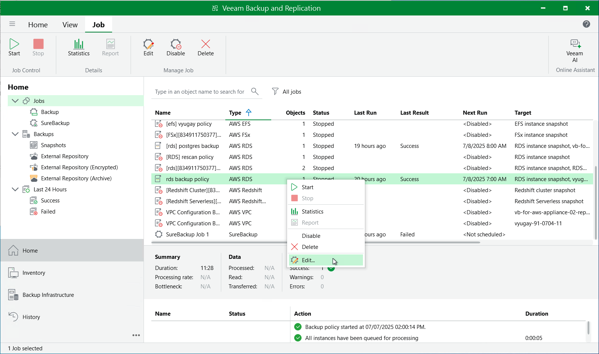

In this article

You can edit backup policies in the Veeam Backup for AWS Web UI only. However, you can launch the edit policy wizard directly from the Veeam Backup & Replication console. To do that, do the following:

1. In the Veeam Backup & Replication console, open the Home view.
2. Navigate to Jobs.
3. Select the necessary backup policy and click Edit on the ribbon.

Alternatively, you can right-click the policy and select Edit.

Veeam Backup & Replication will open the Edit Policy wizard in a web browser. Complete the wizard as described in section [Creating EC2 Backup Policies](add_policy_name.md), [Creating RDS Backup Policies](add_policy_name_rds.md), [Creating DynamoDB Backup Policies](policies_create_dynamo.md), [Creating Redshift Backup Policies](policies_create_redshift.md), [Creating EFS Backup Policies](add_policy_name_efs.md), [Creating FSx Backup Policies](policies_create_fsx.md) or [Editing VPC Configuration Backup Policy](policies_edit_vpc.md). 

Page updated 7/8/2025

Page content applies to build 10.0.0.232
