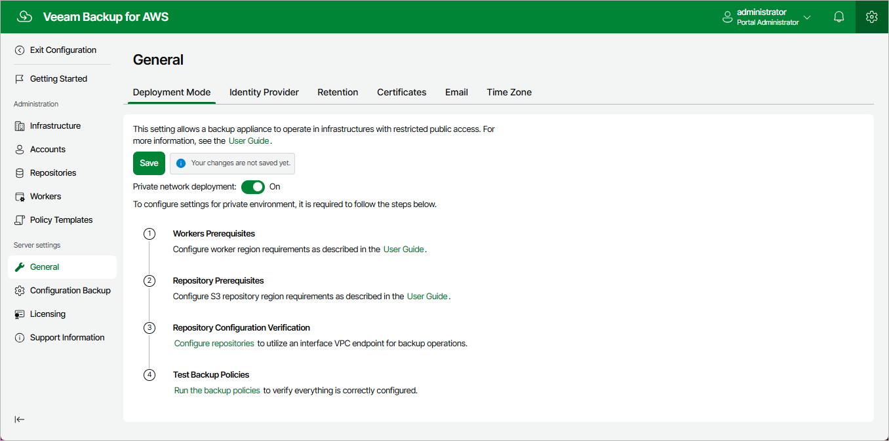

In this article

If you want [worker instances](worker_instances.md) to operate in a private network, you can enable the private network deployment functionality and instruct Veeam Backup for AWS to deploy worker instances without public IPv4 addresses. In this case, worker instances will communicate with the Amazon S3 service through a private S3 endpoint specified in repository settings for data protection and recovery tasks.

To configure private network deployment, do the following:

1. Switch to the Configuration page, navigate to General > Deployment Mode and set the Private network deployment toggle to On.

1. To allow worker instances to access AWS services, create VPC interface endpoints for all subnets to which the worker instances will be connected, as described in section [Configuring Private Networks](create_interface_endpoints.md#interface_endpoints) (step 1).
2. To allow worker instances to communicate with the Amazon S3 service, do the following:

1. For all VPCs in the AWS Regions where backup repositories are located, create an S3 interface endpoint for all subnets to which worker instances will be connected, as described in section [Configuring Private Networks](create_interface_endpoints.md#s3_endpoints) (step 1).
2. For the backup appliance and worker instances, ensure connectivity between them and the Amazon S3 service, as described in section [Configuring Private Networks](create_vpc_peering_connection.md) (steps 2–3).

1. To allow Veeam Backup for AWS to deploy worker instances based on VPC networks and subnets for which you have created VPC interface endpoints, add the necessary worker configurations as described in section [Managing Worker Configurations](worker_settings.md).

If you do not add specific worker configurations, Veeam Backup for AWS will either the default or the most appropriate network settings of AWS Regions.

1. To allow worker instances to access Amazon S3 buckets, configure repository settings to use the created S3 interface endpoint for backup operations:

1. Click Save to enable the private network deployment functionality.
2. Click the Configure repositories link.
3. In the Configuration Issues window, click the link in the Settings column.

For a backup repository to be displayed in the list of available repositories, it must be added to Veeam Backup for AWS as described in section [Managing Backup Repositories](repositories.md).

1. In the Edit Repository wizard, navigate to the Settings step. Then, from the Interface VPC endpoint drop-down list, select the S3 interface endpoint that will be used to communicate with the Amazon S3 service.

For an S3 interface endpoint to be displayed in the Interface VPC endpoint list, it must be created in the Amazon VPC console for all subnets to which the worker instances will be connected, as described in section [Configuring Private Networks](create_interface_endpoints.md#s3_endpoints) (step 1). Note that the created endpoint must have the Available status.

To check whether you have configured all the necessary settings correctly, run your backup policies as described in section [Performing Backup](backup.md). However, keep in mind that the next run of the backup policies may take more time to complete due to network latency.

|  |
| --- |
| Important |
| If you enable the private network deployment functionality, consider the following:   * Worker instances will communicate with the Amazon S3 service through a private S3 endpoint specified in [repository settings](repositories_add_s3endpoint.md) — but only to perform data protection and recovery tasks, as well as retention tasks. To access the service while restoring the backup appliance configuration, exporting VPC configuration, creating and editing backup repositories, Veeam Backup for AWS will still use the public s3.<region>.amazonaws.com endpoint.  * Veeam Backup for AWS must be able to connect to the public s3.<region>.amazonaws.com endpoint to access temporary Amazon S3 buckets required for protecting Microsoft SQL Server DB instances. Otherwise, backup policies processing these instances will fail to produce image-level backups. For more information on the temporary buckets, see [Performing RDS Backup](add_policy_target_settings_backups_rds.md). |

Page updated 12/11/2025

Page content applies to build 10.0.0.232
