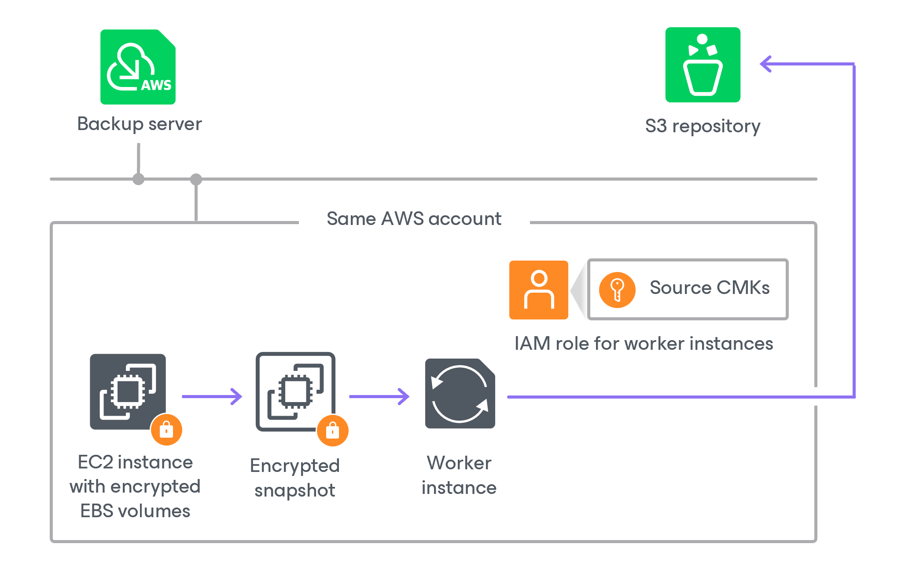
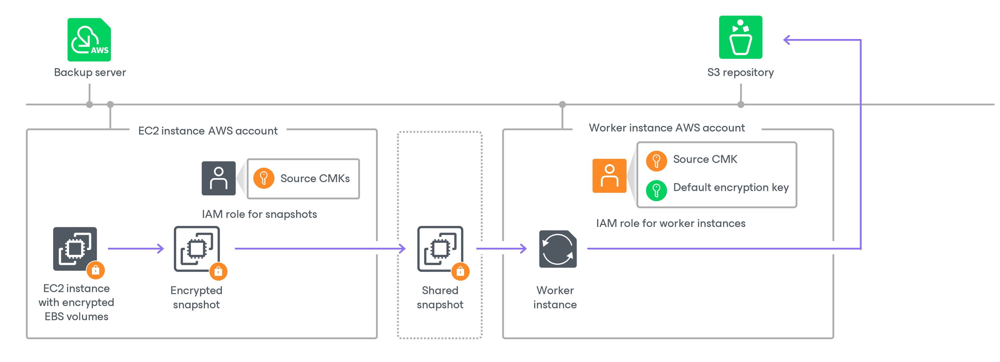

In this article

The process of creating an image-level backup of an EC2 instance with encrypted EBS volumes differs depending on whether a worker instance processing EBS volume data is deployed in the same AWS account or not:

* [Creating the image-level backup in the same AWS account where the worker instance is deployed](#s3_same).
* [Creating the image-level backup in an AWS account other than the AWS account where the worker instance is deployed](#s3_different).

Creating Image-Level Backup in Same AWS Account

If a worker instance is deployed in the same AWS account to which the processed EC2 instance belongs, Veeam Backup for AWS performs the following steps:

1. Creates an encrypted cloud-native snapshot of the EC2 instance.
2. Creates encrypted EBS volumes from the snapshot, and then attaches them to the worker instance for reading and further transferring EBS volume data to a backup repository.

To access the data, Veeam Backup for AWS uses an IAM role specified to deploy worker instances, as described in section [Managing Worker Configurations](worker_settings.md). The IAM role must have permissions to access the KMS keys with which EBS volumes of the EC2 instance are encrypted (source KMS keys).

Creating Image-Level Backup in Another AWS Account

If a worker instance is deployed in an AWS account other than the AWS account to which the processed EC2 instance belongs, Veeam Backup for AWS performs the following steps:

1. Creates an encrypted cloud-native snapshot of the EC2 instance.
2. Shares the created snapshot with the AWS account where the worker instance is deployed.

To share the encrypted snapshot, Veeam Backup for AWS uses the IAM role specified at the Sources step of the Add Policy wizard, as described in section [Creating EC2 Backup Policies](add_policy_scope.md#role). The IAM role must have permissions to access the KMS keys with which EBS volumes of the EC2 instance are encrypted (source KMS keys).

|  |
| --- |
| Important |
| If EBS volumes of the EC2 instance are encrypted with the [default key for EBS encryption (aws/ebs alias)](https://docs.aws.amazon.com/AWSEC2/latest/UserGuide/EBSEncryption.html#EBSEncryption_key_mgmt), Veeam Backup for AWS will not be able to share the snapshot with another AWS account and the backup process will fail to complete successfully. To work around the issue, enable the worker deployment in production accounts functionality, as described in [Creating EC2 Backup Policies](add_policy_target_settings_backups.md#workers). |

1. Creates encrypted EBS volumes from the shared encrypted snapshot, and then attaches them to the worker instance for reading and further transferring EBS volume data to a backup repository.

Due to AWS requirements, EBS volumes created from encrypted snapshots must also be encrypted. Thus, Veeam Backup for AWS encrypts re-created EBS volumes with the [default encryption key](https://www.veeam.com/kb3057#default_encryption_key) specified for the AWS Region where the worker instance is deployed.

To access the data, Veeam Backup for AWS uses an IAM role specified to deploy worker instances, as described in section [Managing Worker Configurations](worker_settings.md). The IAM role must have permissions to access the following KMS keys:

* The KMS keys with which EBS volumes of the EC2 instance are encrypted (source KMS keys).
* The default encryption key specified for the AWS Region where the worker instance is deployed.

Page updated 5/21/2025

Page content applies to build 10.0.0.232
