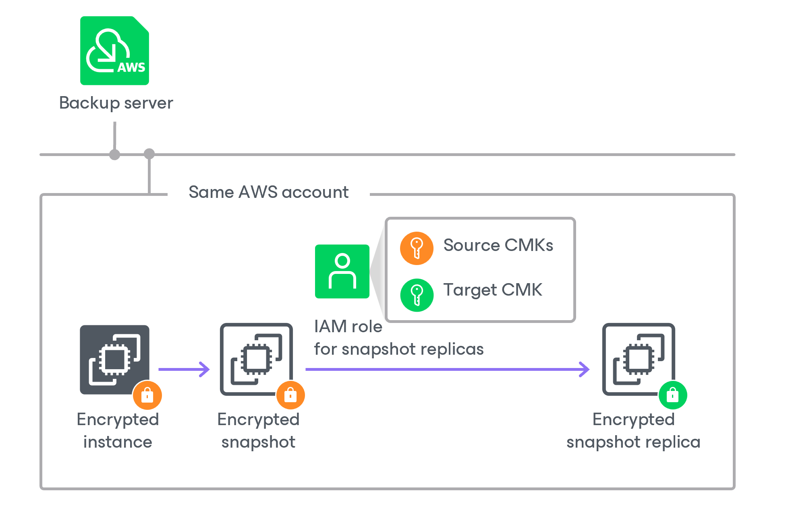
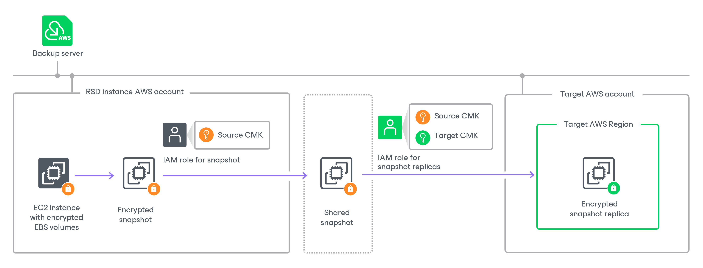
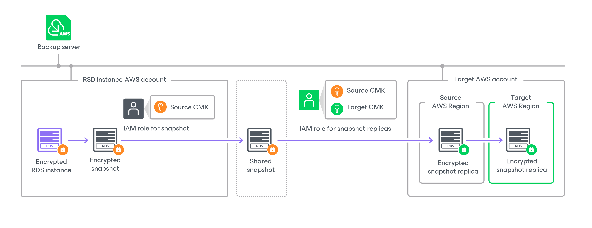

In this article

The process of creating a snapshot replica of an encrypted RDS instance and an EC2 instance with encrypted EBS volumes differs depending on whether you create snapshot replicas within the same AWS account to which the instance belongs or not:

* [Creating the snapshot replica in the same AWS account to which the instance belongs](#replicas_same).
* [Creating the snapshot replica in an AWS account other than the AWS account to which the instance belongs](#replicas_different).

Creating Snapshot Replica in Same AWS Account

To create a snapshot replica in the same AWS account to which the encrypted EC2 or RDS instance belongs, Veeam Backup for AWS performs the following steps:

1. Takes an encrypted cloud-native snapshot of the instance.
2. Copies the created snapshot to the target AWS Region.

To copy the encrypted snapshot, Veeam Backup for AWS uses an IAM role specified at the Targets step of the Add Policy wizard, as described in sections [Creating EC2 Backup Policies](add_policy_target_settings_replica.md#step2.b) and [Creating RDS Backup Policies](add_policy_target_settings_rds_replica.md#step2.b). The IAM role must have permissions to access the following KMS keys:

* KMS keys with which data of the source instance is encrypted (source KMS keys).
* A KMS key with which you want to encrypt instance data in the snapshot replica (target KMS key).

|  |
| --- |
| Important |
| If you do not specify a target KMS key in the backup policy settings, Veeam Backup for AWS will not create a snapshot replica for the encrypted instance, and the backup session will complete with warnings. |

Creating Snapshot Replica in Another AWS Account

The process of creating a snapshot replica differs depending on the AWS resource for which you want to create a snapshot replica:

* [Creating the snapshot replica in an AWS account other than the AWS account to which the EC2 instance belongs](#replicas_different_ec2).
* [Creating the snapshot replica in an AWS account other than the AWS account to which the RDS instance belongs](#replicas_different_rds).

Creating Snapshot Replica of EC2 Instance

To create a snapshot replica in an AWS account other than the AWS account to which the EC2 instance with encrypted EBS volumes belongs, Veeam Backup for AWS performs the following steps:

1. Takes an encrypted cloud-native snapshot of the EC2 instance.
2. Shares the created snapshot with the target AWS account.

To share the encrypted snapshot, Veeam Backup for AWS uses an IAM role specified at the Sources step of the Add Policy wizard, as described in section [Creating EC2 Backup Policies](add_policy_scope.md#role). The IAM role must have permissions to access the KMS keys with which EBS volumes of the EC2 instance are encrypted (source KMS keys).

|  |
| --- |
| Important |
| If EBS volumes of the EC2 instance are encrypted with the [default key for EBS encryption (aws/ebs alias)](https://docs.aws.amazon.com/AWSEC2/latest/UserGuide/EBSEncryption.html#EBSEncryption_key_mgmt), Veeam Backup for AWS will not be able to share the snapshot with another AWS account and the replication process will fail to complete successfully. For more information, see [this Veeam KB article](https://www.veeam.com/kb3057). |

1. Copies the shared snapshot to the target AWS Region in the target AWS account.

To copy the shared encrypted snapshot, Veeam Backup for AWS uses an IAM role specified at the Targets step of the Add Policy wizard, as described in section [Creating EC2 Backup Policies](add_policy_target_settings_replica.md#step2.b). The IAM role must have permissions to access the following KMS keys:

* The KMS keys with which EBS volumes of the EC2 instance are encrypted (source KMS keys).
* A KMS key with which you want to encrypt EBS volume data in the snapshot replica (target KMS key).

|  |
| --- |
| Important |
| Note that if you do not specify a target KMS key in the backup policy settings, Veeam Backup for AWS will not create a snapshot replica for the encrypted instance, and the backup session will complete with warnings. |

Creating Snapshot Replica of RDS Instance

To create a snapshot replica in an AWS account other than the AWS account to which the encrypted RDS instance belongs, Veeam Backup for AWS performs the following steps:

1. Takes an encrypted cloud-native snapshot of the RDS instance.

1. Shares the created snapshot with the target AWS account.

To share the encrypted snapshot, Veeam Backup for AWS uses an IAM role specified at the Sources step of the Add Policy wizard, as described in section [Creating RDS Backup Policies](add_policy_scope_rds.md#role). The IAM role must have permissions to access the KMS key with which the RDS instance is encrypted (source KMS key).

|  |
| --- |
| Important |
| If the RDS instance is encrypted with the [default encryption key (aws/rds alias)](https://docs.aws.amazon.com/AmazonRDS/latest/UserGuide/USER_ShareSnapshot.html), Veeam Backup for AWS will not be able to share the snapshot with another AWS account and the replication process will fail to complete successfully. For more information, see [this Veeam KB article](https://www.veeam.com/kb3057). |

1. In the target AWS account, copies the shared encrypted snapshot to the same AWS Region to which the RDS instance belongs in the source AWS account. Then, if the target AWS Region differs from the source AWS Region, copies the shared snapshot to the target AWS Region.

To copy the shared encrypted snapshot, Veeam Backup for AWS uses an IAM role specified at the Targets step of the Add Policy wizard, as described in section [Creating RDS Backup Policies](add_policy_target_settings_rds_replica.md#step2.b). The IAM role must have permissions to access the following KMS keys:

* The KMS key with which the RDS instance is encrypted (source KMS key).
* A KMS key with which you want to encrypt RDS instance data in the snapshot replica (target KMS key).

|  |
| --- |
| Important |
| If you do not specify a target KMS key in the backup policy settings, Veeam Backup for AWS will not create a snapshot replica for the encrypted instance, and the backup session will complete with warnings. |

Page updated 5/21/2025

Page content applies to build 10.0.0.232
