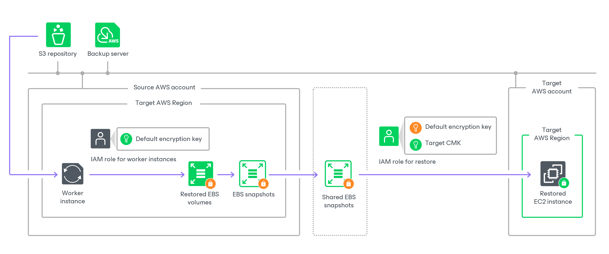

In this article

The process of restoring an EC2 instance with encrypted EBS volumes from an image-level backup differs depending on whether a worker instance is deployed in the same AWS account to which you perform restore or not:

* [Performing restore from the image-level backup to the AWS account where the worker instance is deployed](#restore_s3_same).
* [Performing restore from the image-level backup to an AWS account other than the AWS account where the worker instance is deployed](#restore_s3_different).

|  |
| --- |
| Note |
| * An AWS account to which an IAM role specified for deploying worker instances belongs is also referred to as the source AWS account.  * An AWS account to which you restore an instance is also referred to as the target AWS account. * To perform EC2 instance restore operations from image-level backups, Veeam Backup for AWS deploys worker instances in a target AWS Region specified in the restore settings. |

Restore to Same AWS Account

If a worker instance is deployed in the same AWS account to which the restored EC2 instance will belong, to encrypt EBS volumes of the restored EC2 instance, Veeam Backup for AWS uses an IAM role specified to deploy worker instances, as described in section [Configuring Worker Instance Settings](worker_settings.md). The IAM role must have permissions to access to the KMS key with which you want to encrypt EBS volumes of the restored EC2 instance.

Restore to Another AWS Account

If a worker instance is deployed in an AWS account other than the AWS account to which the restored EC2 instance will belong, Veeam Backup for AWS performs the following steps:

1. Creates empty EBS volumes in the target AWS Region in the source AWS account and attaches them to the worker instance. To protect data that will be restored to these volumes, Veeam Backup for AWS encrypts the created EBS volumes with the [default encryption key](https://www.veeam.com/kb3057#default_encryption_key) specified for the target AWS Region.

To encrypt the volumes, Veeam Backup for AWS uses an IAM role specified to deploy worker instances, as described in section [Managing Worker Configurations](worker_settings.md). The IAM role must have permissions to access to the default encryption key specified for the target AWS Region in the source AWS account.

1. Restores backed-up data to the empty EBS volumes on the worker instance.
2. Creates an encrypted cloud-native snapshot of the EBS volumes with the restored data.
3. Shares the created snapshot with the target AWS account.

|  |
| --- |
| Important |
| Due to AWS limitations, cloud-native snapshots encrypted with the [default key for EBS encryption (aws/ebs alias)](https://docs.aws.amazon.com/AWSEC2/latest/UserGuide/EBSEncryption.html#EBSEncryption_key_mgmt) cannot be shared with other AWS accounts. Thus, if the default encryption key specified for the target AWS Region in the source AWS account is the default key for EBS encryption, Veeam Backup for AWS will not be able to share the snapshot and the restore process will fail to complete successfully. For more information, see [this Veeam KB article](https://www.veeam.com/kb3057). |

1. Creates an EC2 instance in the target AWS Region within the target AWS account.
2. Creates encrypted EBS volumes from the shared encrypted snapshot and attaches them to the created EC2 instance.

To create and encrypt EBS volumes, Veeam Backup for AWS uses an IAM role specified for the restore operation, as described in section [Performing Entire EC2 Instance Restore](restore_entire_account.md). The IAM role must have permissions to access the following KMS keys:

* The default encryption key specified for the target AWS Region in the source AWS account.

* A KMS key with which you want to encrypt EBS volumes of the restored EC2 instance (target KMS key).

Page updated 5/21/2025

Page content applies to build 10.0.0.232
