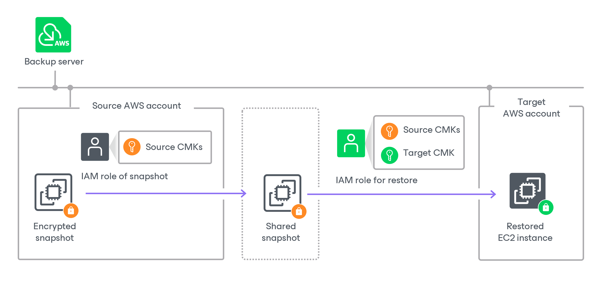
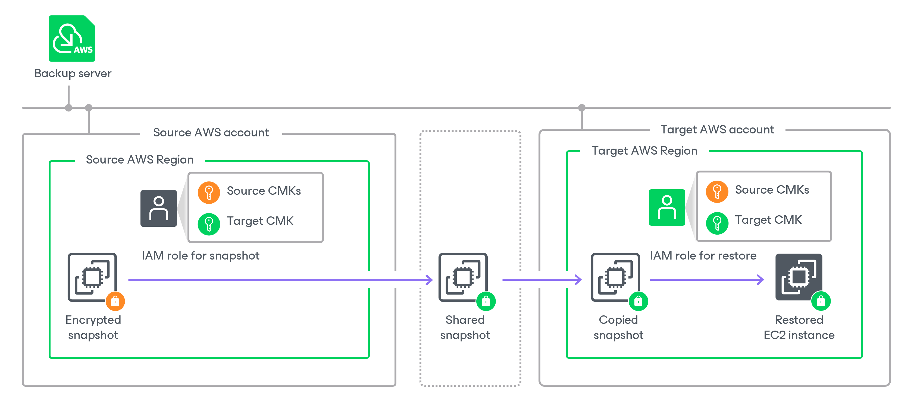
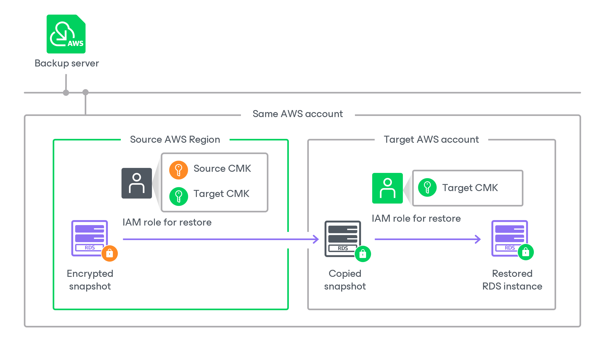
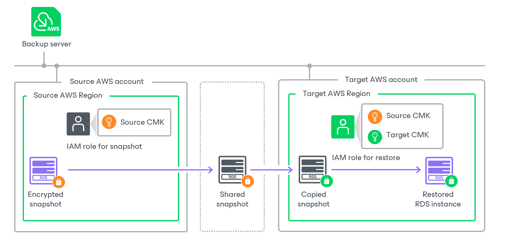
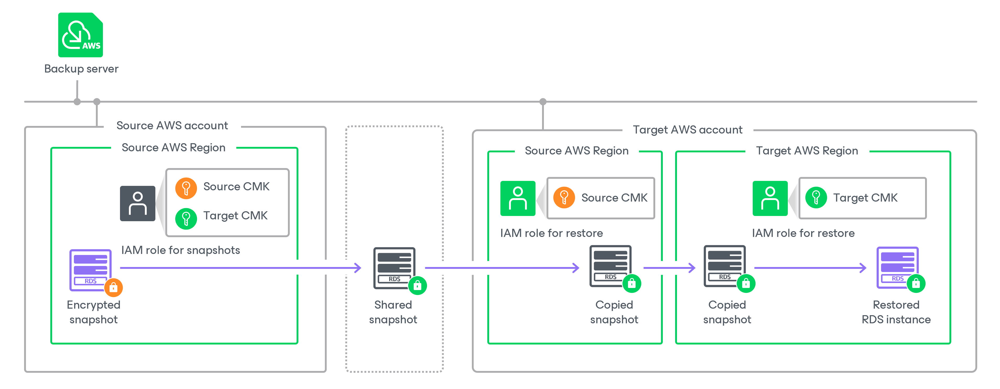

In this article

The process of restoring an RDS or EC2 instance from an encrypted cloud-native snapshot differs depending on whether you perform restore to the original location where the cloud-native snapshot was stored or to a new location:

* [Restoring the instance to the original location where the snapshot resides](#restore_snapshots_same).
* [Restoring the instance to a new location](#restore_snapshots_region).

|  |
| --- |
| Note |
| * An AWS account to which the cloud-native snapshot belongs is also referred to as the source AWS account.  * An AWS account to which you restore the instance is also referred to as the target AWS account. |

Restoring to Original Location

To restore an EC2 or RDS instance to the location where the snapshot resides, Veeam Backup for AWS uses an IAM role specified for the restore operation, as described in sections [Performing Entire EC2 Instance Restore](restore_entire_account.md) and [Performing RDS Instance Restore](restore_rds_account.md). The IAM role must have permissions to access the following KMS keys:

* KMS keys with which the cloud-native snapshot is encrypted.
* A KMS key with which you want to encrypt data of the restored instance.

Restoring to New Location

The process of restoring to a new location differs depending on the AWS resource you want to restore and the specific use case:

* [Restoring the EC2 instance to another AWS Region in the same AWS account](#restore_snapshots_region_ec2).
* [Restoring the EC2 instance in another AWS account to the same AWS Region](#restore_snapshots_account).
* [Restoring the EC2 instance in another AWS account to another AWS Region](#restore_snapshots_account_region).
* [Restoring the RDS instance to another AWS Region in the same AWS account](#restore_snapshots_region_rds).
* [Restoring the RDS instance in another AWS account to the same AWS Region](#restore_snapshots_account_rds).
* [Restoring the RDS instance in another AWS account to another AWS Region](#restore_snapshots_account_region_rds).

Restoring EC2 instance to Another AWS Region in Same AWS Account

To restore an EC2 instance to another AWS Region in the same AWS account to which the cloud-native snapshot belongs, Veeam Backup for AWS performs the following steps:

1. Copies the encrypted cloud-native snapshot to the target AWS Region.
2. Creates an EC2 instance in the target AWS Region.
3. Creates encrypted EBS volumes from the copied encrypted snapshot and attaches them to the created EC2 instance.

To copy the encrypted snapshot, and to create and encrypt EBS volumes, Veeam Backup for AWS uses an IAM role specified for the restore operation, as described in section [Performing Entire EC2 Instance Restore](restore_entire_account.md). The IAM role must have permissions to access the following KMS keys:

* KMS keys with which the cloud-native snapshot is encrypted (source KMS keys).
* A KMS key with which you want to encrypt EBS volumes of the restored EC2 instance (target KMS key).

Restoring EC2 Instance to Same AWS Region but in Another AWS Account

To restore an EC2 instance in another AWS account to the same AWS Region where the cloud-native snapshot resides, Veeam Backup for AWS performs the following steps:

1. Shares the encrypted cloud-native snapshot with the target AWS account.

To share the encrypted snapshot, Veeam Backup for AWS uses an IAM role specified in the backup policy settings [for creating cloud-native snapshots](add_policy_scope.md#role) (if you perform restore from a snapshot) or [for copying and storing snapshot replicas](add_policy_target_settings_replica.md#step2.b) (if you perform restore from a snapshot replica). The IAM role must have permissions to access the KMS key with which the cloud-native snapshot is encrypted (source KMS keys).

|  |
| --- |
| Important |
| Due to AWS limitations, cloud-native snapshots encrypted with the [default key for EBS encryption (aws/ebs alias)](https://docs.aws.amazon.com/AWSEC2/latest/UserGuide/EBSEncryption.html#EBSEncryption_key_mgmt) cannot be shared with other AWS accounts. Thus, if the cloud-native snapshot is encrypted with the default key for EBS encryption, Veeam Backup for AWS will not be able to share the snapshot and the restore process will fail to complete successfully. For more information, see [this Veeam KB article](https://www.veeam.com/kb3057). |

1. Creates an EC2 instance in the target AWS account in the same AWS Region where the snapshot resides in the source AWS account.
2. Creates encrypted EBS volumes from the shared encrypted snapshot and attaches them to the created EC2 instance.

To create and encrypt EBS volumes, Veeam Backup for AWS uses an IAM role specified for the restore operation, as described in section [Performing Entire EC2 Instance Restore](restore_entire_account.md). The IAM role must have permissions to access the following KMS keys:

* The KMS keys with which the cloud-native snapshot is encrypted (source KMS keys).
* A KMS key with which you want to encrypt EBS volumes of the restored EC2 instance (target KMS key).

Restoring EC2 Instance to Another AWS Region in Another AWS Account

To restore an EC2 instance to another AWS Region in an AWS account other than the AWS account to which the cloud-native snapshot belongs, Veeam Backup for AWS performs the following steps:

1. Shares the encrypted cloud-native snapshot with the target AWS account.

To share the encrypted snapshot, Veeam Backup for AWS uses an IAM role specified in the backup policy settings [for creating cloud-native snapshots](add_policy_scope.md#role) (if you perform restore from a snapshot) or [for copying and storing snapshot replicas](add_policy_target_settings_replica.md#step2.b) (if you perform restore from a snapshot replica). The IAM role must have permissions to access the following KMS keys:

* KMS keys with which the cloud-native snapshot is encrypted (source KMS keys).
* A KMS key with which you want to encrypt EBS volumes of the restored EC2 instance (target KMS key).

|  |
| --- |
| Important |
| Due to AWS limitations, cloud-native snapshots encrypted with the [default key for EBS encryption (aws/ebs alias)](https://docs.aws.amazon.com/AWSEC2/latest/UserGuide/EBSEncryption.html#EBSEncryption_key_mgmt) cannot be shared with other AWS accounts. Thus, if the cloud-native snapshot is encrypted with the default key for EBS encryption, Veeam Backup for AWS will not be able to share the snapshot and the restore process will fail to complete successfully. For more information, see [this Veeam KB article](https://www.veeam.com/kb3057). |

1. Copies the shared snapshot to the target AWS Region in the target AWS account.
2. Creates an EC2 instance in the target AWS Region in the target AWS account.
3. Creates encrypted EBS volumes from the shared encrypted snapshot and attaches them to the created EC2 instance.

To copy the snapshot, create and encrypt EBS volumes, Veeam Backup for AWS uses an IAM role specified for the restore operation, as described in section [Performing Entire EC2 Instance Restore](restore_entire_account.md). The IAM role must have permissions to access the following KMS keys:

* The KMS keys with which the cloud-native snapshot is encrypted (source KMS keys).
* The KMS key with which you want to encrypt EBS volumes of the restored EC2 instance (target KMS key).

Restoring RDS Instance to Another AWS Region in Same AWS Account

To restore an RDS instance to a another AWS Region in the same AWS account to which the cloud-native snapshot belongs, Veeam Backup for AWS performs the following steps:

1. Copies the encrypted cloud-native snapshot to the target AWS Region.

1. Creates an RDS instance from the copied encrypted snapshot in the target AWS Region.

To copy the encrypted snapshot, and to create the RDS instance, Veeam Backup for AWS uses an IAM role specified for the restore operation, as described in section [Performing RDS Instance Restore](restore_rds_account.md). The IAM role must have permissions to access the following KMS keys:

* A KMS key with which the cloud-native snapshot is encrypted (source KMS key).
* A KMS key with which you want to encrypt the restored RDS instance (target KMS key).

Restoring RDS Instance to Same AWS Region but in Another AWS Account

To restore an RDS instance in another AWS account to the same AWS Region where the cloud-native snapshot resides, Veeam Backup for AWS performs the following steps:

1. Shares the encrypted cloud-native snapshot with the target AWS account.

To share the encrypted snapshot, Veeam Backup for AWS uses an IAM role specified in the backup policy settings [for creating cloud-native snapshots](add_policy_scope_rds.md#role) (if you restore from a snapshot) or [for copying and storing snapshot replicas](add_policy_target_settings_rds_replica.md#step2.b) (if you restore from a snapshot replica). The IAM role must have permissions to access the KMS key with which the cloud-native snapshot is encrypted (source KMS key).

|  |
| --- |
| Important |
| Due to AWS limitations, cloud-native snapshots encrypted with the [default encryption key (aws/rds alias)](https://docs.aws.amazon.com/AmazonRDS/latest/UserGuide/USER_ShareSnapshot.html) cannot be shared with other AWS accounts. Thus, if the cloud-native snapshot is encrypted with the default encryption key, Veeam Backup for AWS will not be able to share the snapshot and the restore process will fail to complete successfully. For more information, see [this Veeam KB article](https://www.veeam.com/kb3057). |

1. In the target AWS account, copies the shared snapshot to the same AWS Region where the snapshot resides in the source AWS account, and re-encrypts the snapshot with the KMS keys that you specified to encrypt the restored RDS instance.

To copy the shared encrypted snapshot and to re-encrypt it, Veeam Backup for AWS uses an IAM role specified for the restore operation, as described in section [Performing RDS Instance Restore](restore_rds_account.md). The IAM role must have permissions to access the following KMS keys:

* The KMS key with which the cloud-native snapshot is encrypted (source KMS key).
* A KMS key with which you want to encrypt the restored RDS instance (target KMS key).

1. Creates an encrypted RDS instance from the copied encrypted snapshot in the target AWS account in the same AWS Region where the snapshot resides in the source AWS account.

To create and encrypt the RDS instance, Veeam Backup for AWS uses an IAM role specified for the restore operation, as described in section [Performing RDS Instance Restore](restore_rds_account.md). The IAM role must have permissions to access the KMS key with which you want to encrypt the restored RDS instance (target KMS key).

Restoring RDS Instance to Another AWS Region in Another AWS Account

To restore an RDS instance to another AWS Region in an AWS account other than the AWS account to which the cloud-native snapshot belongs, Veeam Backup for AWS performs the following steps:

1. Shares the encrypted cloud-native snapshot with the target AWS account.

To share the encrypted snapshot, Veeam Backup for AWS uses an IAM role specified in the backup policy settings [for creating cloud-native snapshots](add_policy_scope_rds.md#role) (if you restore from a snapshot) or [for copying and storing snapshot replicas](add_policy_target_settings_rds_replica.md#step2.b) (if you restore from a snapshot replica). The IAM role must have permissions to access the following KMS keys:

* A KMS key with which the cloud-native snapshot is encrypted (source KMS key).
* A KMS key with which you want to encrypt the restored RDS instance (target KMS key).

|  |
| --- |
| Important |
| Due to AWS limitations, cloud-native snapshots encrypted with the [default encryption key (aws/rds alias)](https://docs.aws.amazon.com/AmazonRDS/latest/UserGuide/USER_ShareSnapshot.html) cannot be shared with other AWS accounts. Thus, if the cloud-native snapshot is encrypted with the default encryption key, Veeam Backup for AWS will not be able to share the snapshot and the restore process will fail to complete successfully. For more information, see [this Veeam KB article](https://www.veeam.com/kb3057). |

1. In the target AWS account, copies the shared snapshot to the same AWS Region where the snapshot resides in the source AWS account.

To copy the shared encrypted snapshot, Veeam Backup for AWS uses an IAM role specified for the restore operation, as described in section [Performing RDS Instance Restore](restore_entire_account.md). The IAM role must have permissions to access the KMS key with which the cloud-native snapshot is encrypted (source KMS key).

1. Copies the copied encrypted snapshot to the target AWS Region in the target AWS account and re-encrypts the snapshot with the KMS key specified to encrypt the restored RDS Instance.

1. Creates an encrypted RDS instance in the target AWS Region in the target AWS account.

To copy and re-encrypt the snapshot, create and encrypt the RDS instance, Veeam Backup for AWS uses an IAM role specified for the restore operation, as described in section [Performing RDS Instance Restore](restore_rds_account.md). The IAM role must have permissions to access the KMS key with which you want to encrypt the restored RDS instance (target KMS key).

Page updated 5/21/2025

Page content applies to build 10.0.0.232
