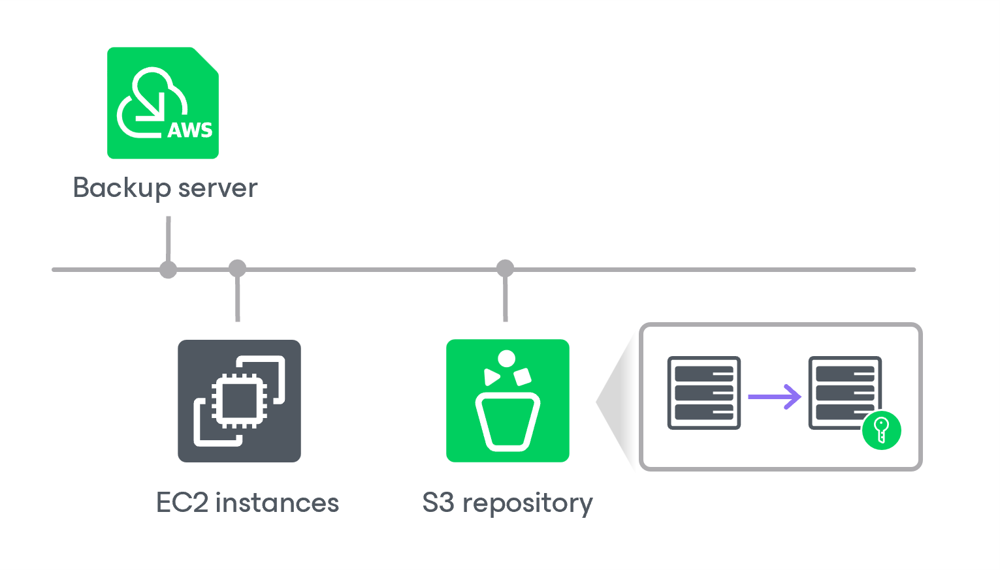

In this article

Veeam Backup for AWS allows you to enable encryption at the repository level. Veeam Backup for AWS encrypts backup files stored in backup repositories the same way as Veeam Backup & Replication encrypts backup files stored in backup repositories. To learn what algorithms Veeam Backup & Replication uses to encrypt backup files, see the Veeam Backup & Replication User Guide, section [Data Encryption](https://helpcenter.veeam.com/docs/vbr/userguide/data_encryption.html?ver=13).

To enable encryption for a backup repository added to Veeam Backup for AWS, configure the repository settings as described in section [Adding Backup Repositories](repositories_add_encryption.md) and choose whether you want to encrypt data using a password or using a KMS encryption key. After you create a backup policy and specify the backup repository as a target location for backed-up data as described in sections [Creating EC2 Backup Policies](policies_create.md), [Creating RDS Backup Policies](policies_create_rds.md), [Creating EFS Backup Policies](policies_create_efs.md) and [Editing VPC Configuration Backup Policy](policies_edit_vpc.md), Veeam Backup for AWS performs the following steps:

1. Based on the provided password or KMS key, generates an encryption key to protect backed-up data stored in the backup repository, and stores the key in the configuration database on the backup appliance.
2. Uses the generated key to encrypt backed-up data transferred to the backup repository when running the backup policy.

Page updated 8/8/2025

Page content applies to build 10.0.0.232
