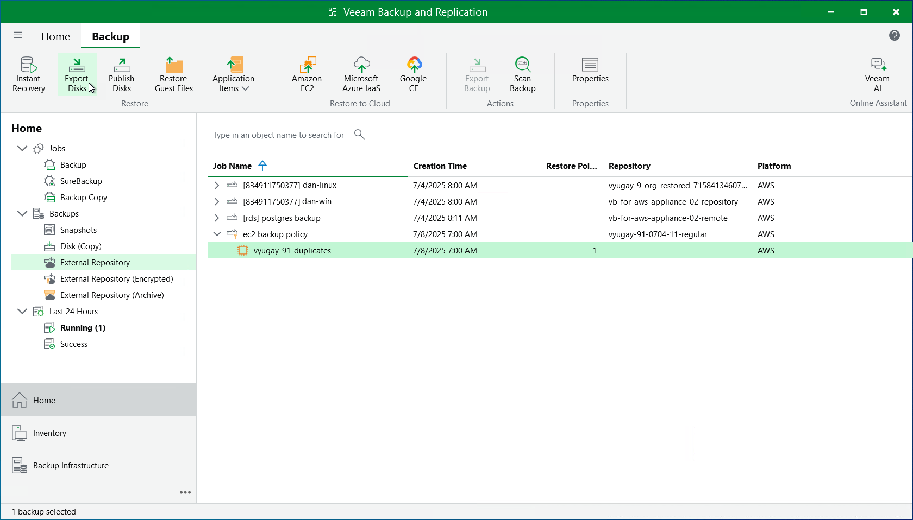

In this article

Veeam Backup & Replication allows you to export disks, that is, to restore EBS volumes of EC2 instances from image-level backups created by Veeam Backup for AWS and to convert them to the VMDK, VHD and VHDX formats. You can save the converted disks to any server added to the backup infrastructure or place the disks on a datastore connected to an ESXi host (for the VMDK disk format only). For more information, see the Veeam Backup & Replication, section [Disk Export](https://helpcenter.veeam.com/docs/vbr/userguide/disk_export.html?ver=13).

|  |
| --- |
| Important |
| Disk export can be performed only using backup files stored in standard backup repositories for which you have specified access keys of an IAM user whose permissions are used to access the repositories. To learn how to specify credentials for the repositories, see sections [Creating New Repositories](add_s3_account.md) and [Connecting to Existing Appliances](connect_appliance_repo.md). |

To export EBS volumes of EC2 instance to the VMDK, VHD or VHDX format, do the following:

1. In the Veeam Backup & Replication console, open the Home view.
2. Navigate to Backups > External Repository.
3. Expand the backup policy that protects an EC2 instance whose volume you want to restore, select the necessary instance and click Export Disk on the ribbon.
4. Complete the Export Disk wizard as described in the Veeam Backup & Replication User Guide, section [Exporting Disks](https://helpcenter.veeam.com/docs/vbr/userguide/disk_export_machine.html?ver=13).

Page updated 1/5/2026

Page content applies to build 10.0.0.232
