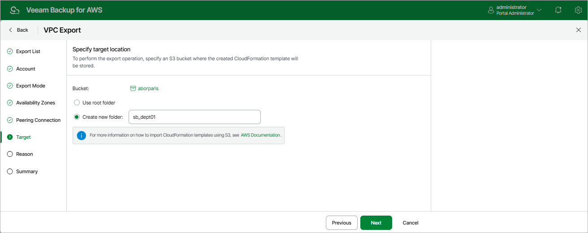

In this article

At the Target step of the wizard, specify an Amazon S3 bucket where Veeam Backup for AWS will save the CloudFormation template with the exported VPC configuration data.

Choose whether you want to save the template in the root folder of the selected Amazon S3 bucket or to create a new folder for the template.

|  |
| --- |
| Note |
| If you enable the [private network deployment](enable_private_network_deployment.md) functionality, Veeam Backup for AWS will still use the public s3.<region>.amazonaws.com endpoint to export VPC configuration. |

Page updated 9/29/2025

Page content applies to build 10.0.0.232
