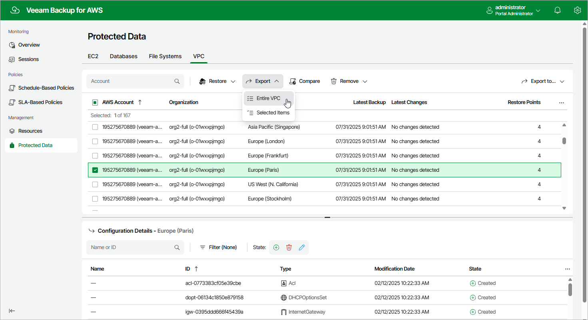

In this article

To launch the VPC Export wizard, do the following:

1. Navigate to Protected Data > VPC.
2. Select the configuration record for an AWS Region whose VPC configuration you want to export.
3. Click Export > Entire VPC.

Page updated 9/29/2025

Page content applies to build 10.0.0.232
