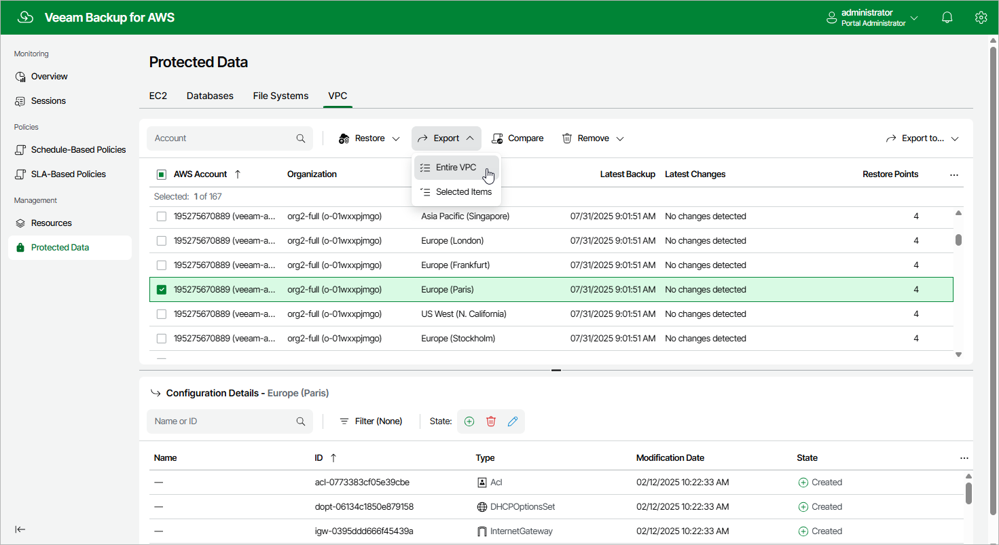

# Step 1. Launch VPC Export Wizard

To launch the VPC Export wizard, do the following:

1. Navigate to Protected Data > VPC.
2. Select the configuration record for an AWS Region whose VPC configuration you want to export.
3. Click Export > Entire VPC.

