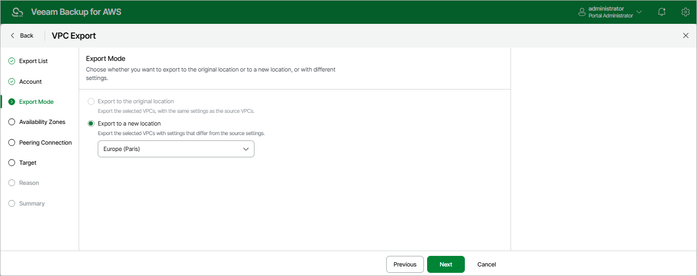

In this article

At the Export Mode step of the wizard, choose whether you plan to restore the exported VPC configuration to the original or to a custom location. If you select the Export to a new location option, specify the target AWS Region where the VPC configuration will be restored.

|  |
| --- |
| Important |
| * If you plan to restore the exported VPC configuration to the original location — when you restore the VPC configuration from the CloudFormation template, all exported VPC configuration items will be newly created in the source AWS Region. If there are any already existing items with the same names in the current VPC configuration, the restored items will be created with new IDs, but with the same names.  * If you plan to restore the exported VPC configuration to a custom location — the source and target AWS Regions may have different lists of the supported AWS services. In this case, when you restore the VPC configuration from the CloudFormation template, VPC endpoints created using an AWS service that is not available in the target AWS Region will not be restored. |

Page updated 9/29/2025

Page content applies to build 10.0.0.232
