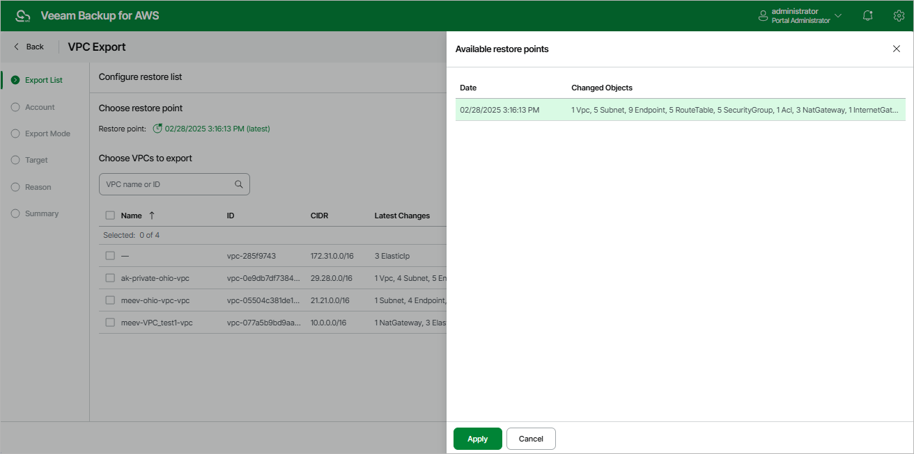

In this article

At the Export List step of the wizard, select the VPC whose configuration you want to export and a restore point that will be used to export the selected VPC configuration. By default, Veeam Backup for AWS uses the most recent valid restore point. However, you can export the VPC configuration data to an earlier state.

To select a restore point, do the following:

1. In the Choose restore point section, click the link to the right of Restore point.
2. In the Available restore points window, select the necessary restore point and click Apply.
3. In the Choose VPCs to export section, select VPCs whose configuration you want to export.

Page updated 9/29/2025

Page content applies to build 10.0.0.232
