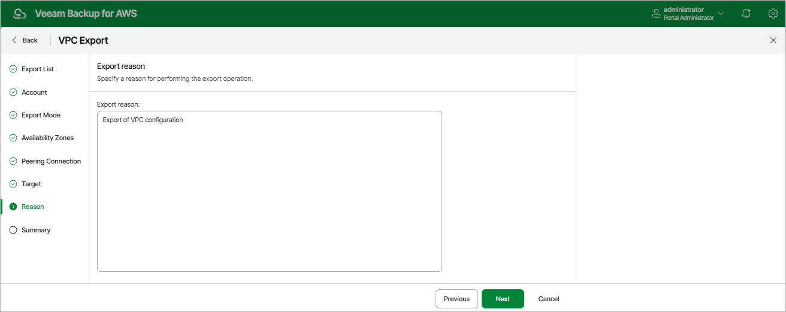

In this article

At the Reason step of the wizard, specify a reason for the export of the VPC configuration. The information you provide will be saved in the session history and you can reference it later.

Page updated 9/29/2025

Page content applies to build 10.0.0.232
