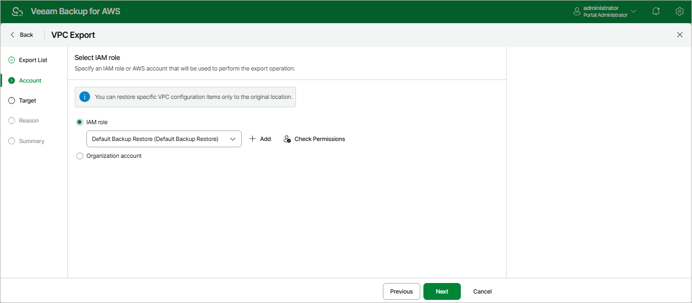

In this article

At the Account step of the wizard, choose whether you want to use an IAM role or an AWS account to allow Veeam Backup for AWS to perform the export operation. For more information on permissions required for the IAM role, see [VPC Configuration Restore IAM Permissions](role_permissions_restore_vpc.md).

Specifying IAM Role

To specify an IAM role to be used for the export operation, select the IAM role option and choose the necessary IAM role from the list. The selected IAM role must belong to an AWS account in which you plan to export the VPC configuration.

For an IAM role to be displayed in the IAM role list, it must be added to Veeam Backup for AWS as described in section [Adding IAM Roles](iam_roles_add.md). If you have not added the necessary IAM role to Veeam Backup for AWS beforehand, you can do it without closing the VPC Export wizard. To do that, click Add and complete the Add IAM Role wizard.

|  |
| --- |
| Important |
| It is recommended that you check whether the selected IAM role has all the permissions required to perform the operation. If some permissions of the IAM role are missing, the export operation may fail to complete successfully. To run the IAM role permission check, click Check Permissions and follow the instructions provided in section [Checking IAM Role Permissions](iam_roles_check.md#wizard). |

Specifying AWS Account

To specify an AWS account to be used for the export operation, do the following:

1. Select the Organization account option.
2. From the Organization drop-down list, choose the necessary organization identity — either an entire AWS Organization or a scope of organizational units.

For an organization or a scope of organizational units to be displayed in the list of available identities, it must be added to Veeam Backup for AWS as described in section [Adding AWS Organizations](organizations_add.md).

1. From the Account drop-down list, choose an account that contains the IAM role whose permissions will be used to perform the export operation. The role must be specified in the settings of the selected organization identity, as described in section [Adding AWS Organizations](organization_add_settings.md#backup_role) (step 3).

For an AWS account to be displayed in the list of available accounts, it must be part of the selected organization identity, and must be included in the scope of organizational units added to Veeam Backup for AWS as described in section [Adding AWS Organizations](organization_add_scope.md) (step 4).

Page updated 9/29/2025

Page content applies to build 10.0.0.232
