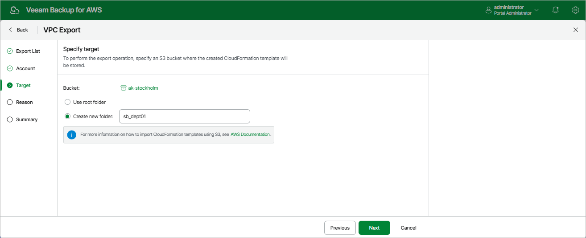

In this article

At the Target step of the wizard, specify an Amazon S3 bucket where Veeam Backup for AWS will save the CloudFormation template with the exported VPC configuration items.

Choose whether you want to save the template in the root folder of the selected Amazon S3 bucket or to create a new folder for the template.

Page updated 9/29/2025

Page content applies to build 10.0.0.232
