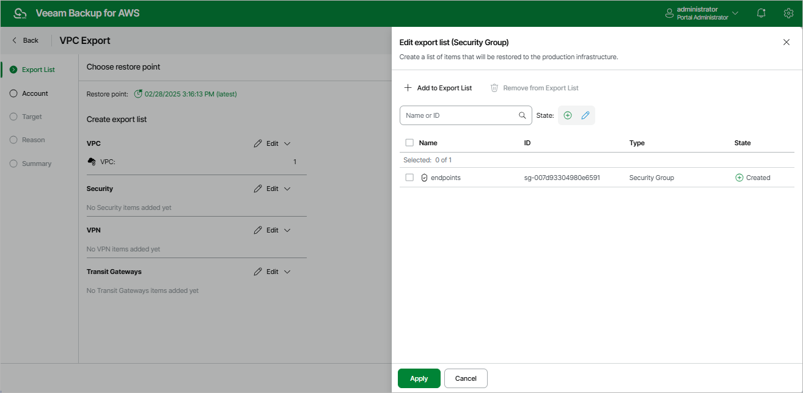

In this article

At the Export List step of the wizard, select the VPC configuration items you want to export and a restore point that will be used to export the selected VPC configuration items. By default, Veeam Backup for AWS uses the most recent valid restore point. However, you can export the VPC configuration data to an earlier state.

1. To select the restore point:

1. In the Choose restore point section, click the link to the right of Restore point.
2. In the Available restore points window, select the necessary restore point and click Apply.

1. To select the VPC configuration items:

1. In the Create export list section, select the type of VPC configuration item you want to export and click Edit.
2. In the Edit export list window, click Add to Export List.
3. In the Item List window, select check boxes next to the items that you want to export, and click Add.
4. In the Edit export list window, review the restore list and click Apply.

|  |
| --- |
| Important |
| When performing the export operation, Veeam Backup for AWS does not validate the export list. If any of the VPC configuration items on which the selected items depend are missing from the current VPC configuration, the restore of the selected VPC configuration items from the created CloudFormation template will fail. |

Page updated 9/29/2025

Page content applies to build 10.0.0.232
