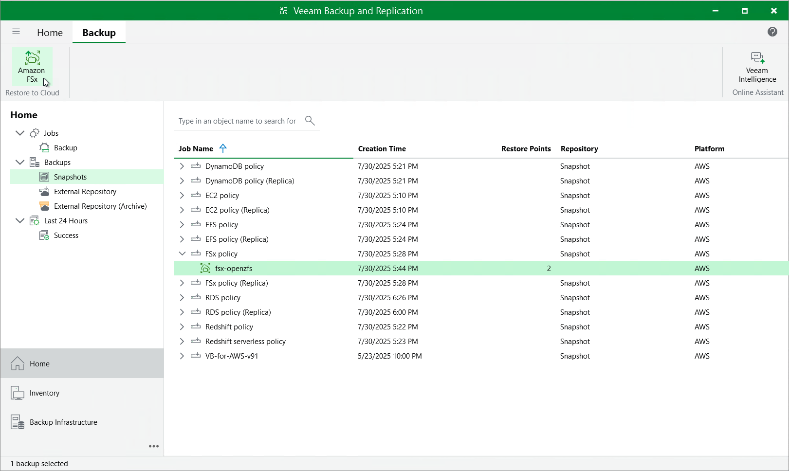

In this article

You can recover corrupted FSx file systems in the Veeam Backup for AWS Web UI only. However, you can launch the FSx Restore wizard directly from the Veeam Backup & Replication console to start the restore operation:

1. In the Veeam Backup & Replication console, open the Home view.
2. Navigate to Backups > Snapshots.
3. Expand the backup policy that protects the FSx file systems you want to recover, select the necessary file system and click Amazon FSx on the ribbon.

Alternatively, you can right-click the selected file system and click Restore to Amazon FSx.

|  |
| --- |
| Important |
| You cannot restore multiple FSx file systems from the Veeam Backup & Replication console. |

Veeam Backup & Replication will open the FSx Restore wizard in a web browser. Complete the wizard as described in section [FSx Restore Using Web UI](restore_point_fsx.md).

Page updated 10/6/2025

Page content applies to build 10.0.0.232
