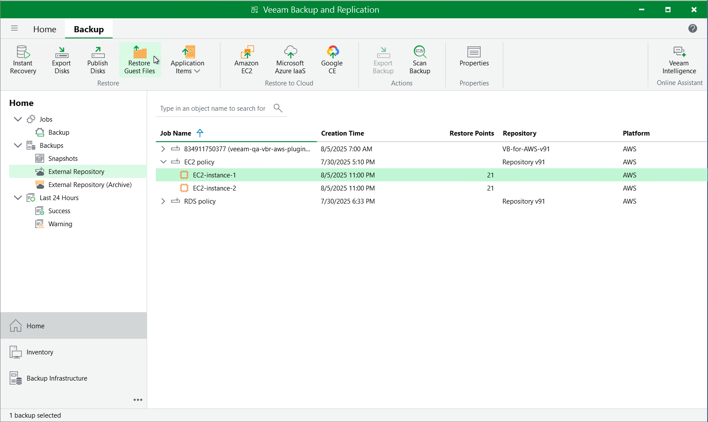

In this article

Veeam Backup & Replication allows you to use image-level backups to restore files and folders of various EC2 guest OS file systems from the Veeam Backup & Replication console. For more information, see the Veeam Backup & Replication User Guide, section [Guest OS File Restore](https://helpcenter.veeam.com/docs/vbr/userguide/guest_file_recovery.html?ver=13).

|  |
| --- |
| Important |
| * Guest OS File Restore can be performed only using backup files stored in standard backup repositories for which you have specified access keys of an IAM user whose permissions are used to access the repository. To learn how to specify credentials for repositories, see sections [Creating New Repositories](add_s3_account.md) and [Connecting to Existing Appliances](connect_appliance_repo.md). * Before you start the restore operation, check the limitations and prerequisites described in the Veeam Backup & Replication User Guide, section [Considerations and Limitations](https://helpcenter.veeam.com/docs/vbr/userguide/vbr_flr_considerations_common.html?ver=13). |

To restore guest OS files and folders, do the following:

1. In the Veeam Backup & Replication console, open the Home view.
2. Navigate to Backups > External Repository.
3. Expand the backup policy that protects an EC2 instance whose files and folders you want to restore, select the necessary instance and click Restore Guest Files on the ribbon.
4. Complete the File Level Restore wizard as described in the Veeam Backup & Replication User Guide, section [Recovering Guest OS Files Using Console](https://helpcenter.veeam.com/docs/vbr/userguide/performing_guest_restore.html?ver=13).

|  |
| --- |
| Tips |
| * If the file system whose files and folders you want to restore is not included in the [list of supported systems](https://helpcenter.veeam.com/docs/vbr/userguide/platform_support.html?ver=13#guest-os-file-restore), you can restore them using the Instant Disk Recovery technology. For more information, see the Veeam Backup & Replication User Guide, section [Restore from Other File Systems](https://helpcenter.veeam.com/docs/vbr/userguide/guest_restore_other.html?ver=13).  * You can also perform file-level recovery using the Veeam Backup for AWS Web UI. To learn how to recover files and folders to a local machine using file-level recovery browser, see [Performing File-Level Recovery](restore_item_perform.md). |

Page updated 8/8/2025

Page content applies to build 10.0.0.232
