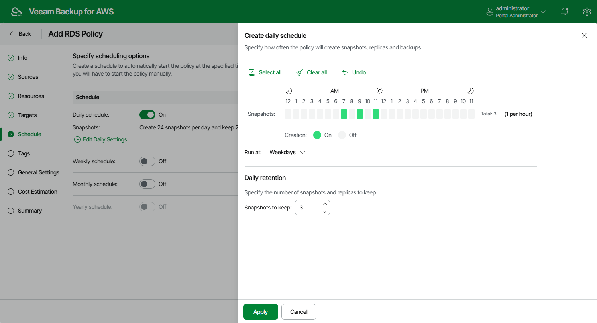
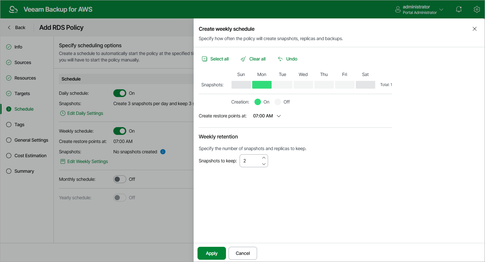
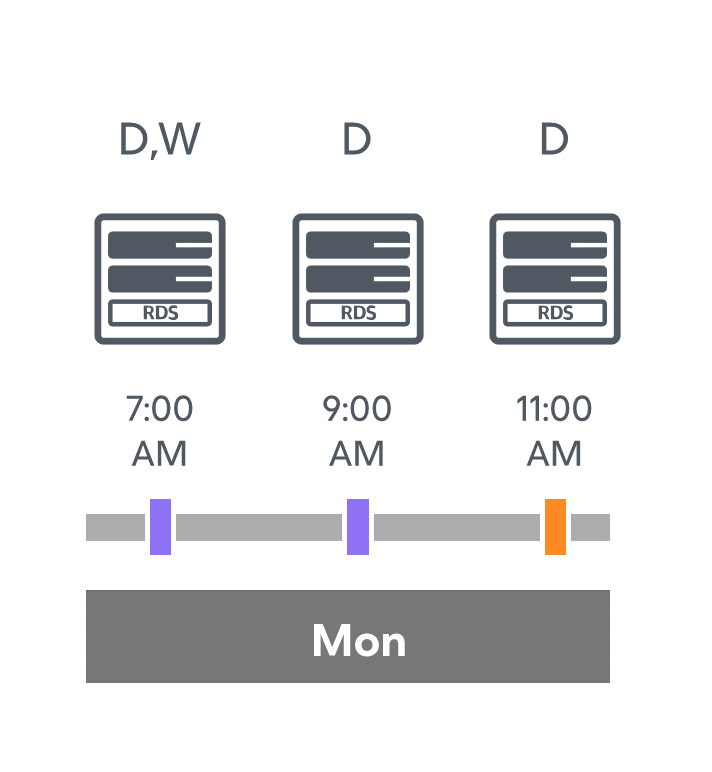
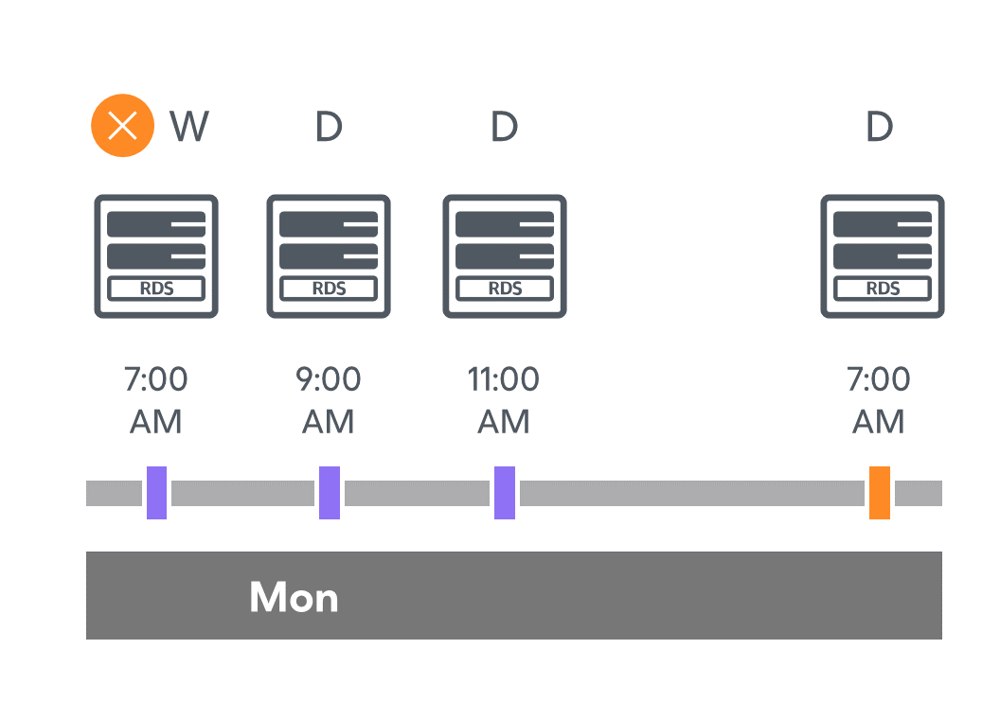
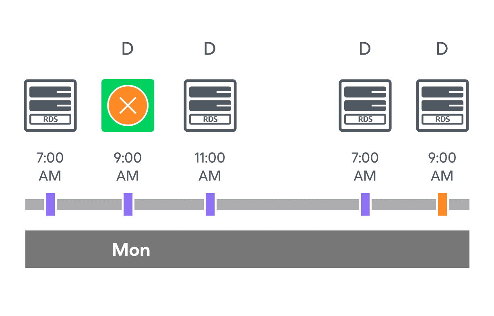
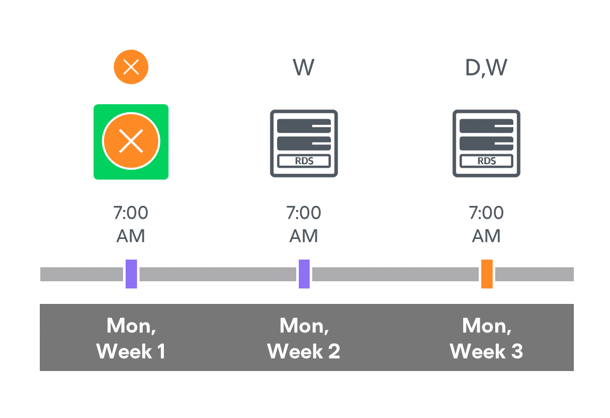

In this article

When you combine multiple types of schedules, Veeam Backup for AWS applies the harmonization mechanism that allows you to leverage restore points for long-term retentions instead of taking a new restore point every time. The mechanism simplifies the backup schedule, optimizes the backup performance and reduces the cost of retaining restore points.

With harmonized scheduling, Veeam Backup for AWS can keep restore points created according to a daily or weekly schedule for longer periods of time: cloud-native snapshots and snapshot replicas can be kept for weeks and months.

For Veeam Backup for AWS to use the harmonization mechanism, there must be specified at least 2 different schedules: one schedule will control the regular creation of restore points, while another schedule will control the process of storing restore points. In terms of harmonized scheduling, Veeam Backup for AWS re-uses restore points created according to a more-frequent schedule (daily or weekly) to achieve the desired retention for less-frequent schedules (weekly and monthly). Each restore point is marked with a flag of the related schedule type: the (D) flag is used to mark restore points created daily, (W) — weekly, and (M) — monthly. Veeam Backup for AWS uses these flags to control the retention period for the created restore points. Once a flag of a less-frequent schedule is assigned to a restore point, this restore point can no longer be removed — it is kept for the period defined in the retention settings. When the specified retention period is over, the flag is unassigned from the restore point. If the restore point does not have any other flags assigned, it is removed according to the retention settings of a more-frequent schedule.

Consider the following example. You want a backup policy to create cloud-native snapshots of your critical workloads 3 times a day, to keep 3 daily snapshots in the snapshot chain, and also to keep one of the created snapshots for 2 weeks. In this case, you create 2 schedules when configuring the backup policy settings — daily and weekly:

* In the daily scheduling settings, you select hours and days when snapshots will be created (for example, 7:00 AM, 9:00 AM, and 11:00 AM; Weekdays), and specify a number of daily restore points to retain (for example, 3).

Veeam Backup for AWS will propagate these settings to the schedule of a lower frequency (which is the weekly schedule in our example).

* In the weekly scheduling settings, you specify which one of the snapshots created by the daily schedule will be retained for a longer period, and choose for how long you want to keep the selected snapshot.

For example, if you want to keep the daily restore point created at 7:00 AM on Monday for 2 weeks, you select 7:00 AM, Monday and specify 2 restore points to retain in the weekly scheduling settings.

According to the specified scheduling settings, Veeam Backup for AWS will create cloud-native snapshots in the following way:

1. On the first work day (Monday), a backup session will start at 7:00 AM to create the first restore point. The restore point will be marked with the (D) flag as it was created according to the daily schedule.

Since 7:00 AM, Monday is specified in the weekly scheduling settings, Veeam Backup for AWS will also assign the (W) flag to this restore point. As a result, 2 flags (D,W) will be assigned to the restore point.

1. On the same day (Monday), after backup sessions run at 9:00 AM and 11:00 AM, the created restore points will be marked with the (D) flag.

1. On the next work day (Tuesday), after a backup session runs at 7:00 AM, the created restore point will be marked with the (D) flag.

By the moment the backup session completes, the number of restore points with the (D) flag will exceed the retention limit specified in the daily scheduling settings. However, Veeam Backup for AWS will not remove the earliest restore point (7:00 AM, Monday) with the (D) flag from the snapshot chain as this restore point is also marked with a flag of a less-frequent schedule. Instead, Veeam Backup for AWS will unassign the (D) flag from the restore point. This restore point will be kept for the retention period specified in the weekly scheduling settings (that is, for 2 weeks).

1. On the same day (Tuesday), after a backup session runs at 9:00 AM, the number of restore points with the (D) flag will exceed the retention limit once again. Veeam Backup for AWS will remove from the snapshot chain the restore point created at 9:00 AM on Monday as no flags of a less-frequent schedule are assigned to this restore point.

1. Veeam Backup for AWS will continue creating restore points for the next week in the same way as described in steps 1–4.
2. On week 3, after a backup session runs at 7:00 AM on Monday, the number of weekly restore points will exceed the retention limit. Veeam Backup for AWS will unassign the (W) flag from the earliest weekly restore point. Since no other flags are assigned to this restore point, Veeam Backup for AWS will remove this restore point from the snapshot chain.

Page updated 10/27/2025

Page content applies to build 10.0.0.232
