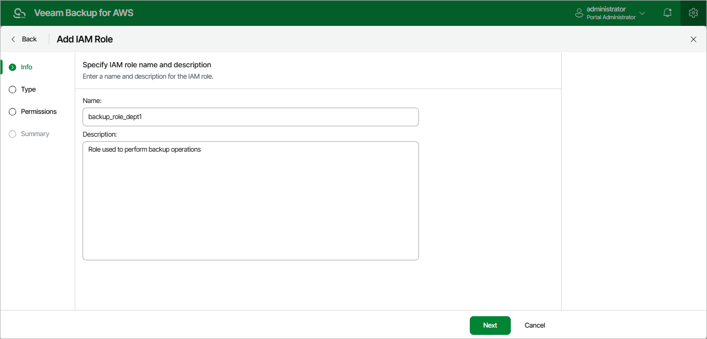

# Step 2. Specify IAM Role Name and Description

At the Info step of the wizard, use the Name and Description fields to enter a name for the new IAM role and to provide a description for future reference. The name must be unique in Veeam Backup for AWS; the maximum length of the name is 127 characters; the maximum length of the description is 255 characters.

|  |
| --- |
| Important |
| The names of IAM roles and organizations that you add to Veeam Backup for AWS must not match. |

