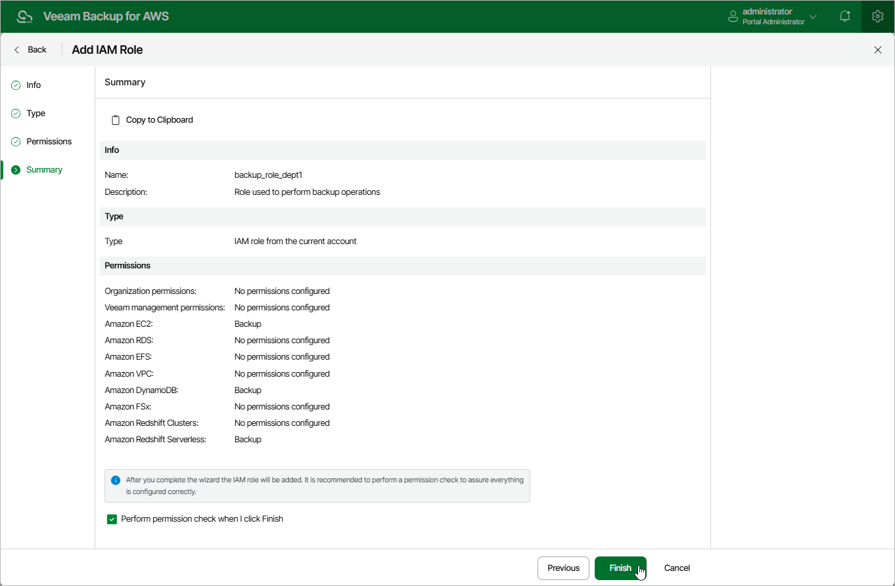

In this article

At the Summary step of the wizard, review configuration information and click Finish.

|  |
| --- |
| Tips |
| * You can view the configured IAM role permissions at the IAM Roles tab. To do that, select the necessary IAM role and click View Permissions. * After you add the IAM role to Veeam Backup for AWS, it is recommended that you verify whether the IAM role has all the permissions required to perform operations with the selected workloads. That is why make sure that the Perform permission check when I click finish check box is selected — in this case, Veeam Backup for AWS will display the Permission check window where you can track the progress and view the results of the check. |

Page updated 7/17/2025

Page content applies to build 10.0.0.232
