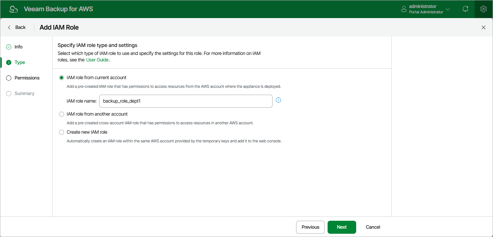

In this article

[This step applies only if you have selected the IAM role from current account option]

At the Type step of the wizard, use the IAM role name field to enter the IAM role name as specified in AWS. If the IAM role was created with a path, you must specify the full path and the name of the IAM role. For example, /dept\_1/backup\_role.

|  |
| --- |
| Important |
| To allow the backup appliance to assume the IAM role, you must configure trust relationships for the role as described in section [Before You Begin](byb_roles.md). |

Page updated 7/4/2025

Page content applies to build 10.0.0.232
