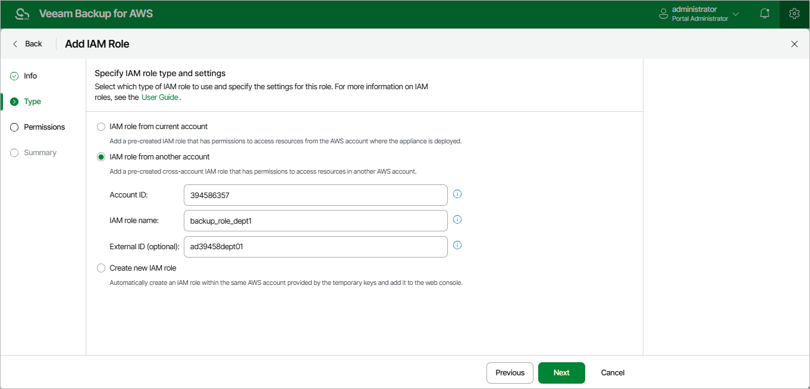

In this article

[This step applies only if you have selected the IAM role from another account option]

At the Type step of the wizard, specify the following settings:

1. In the Account ID field, enter the 12-digit number of the AWS account to which the IAM role you want to add belongs.

1. In the AWS role name field, enter the IAM role name as specified in AWS.

If the IAM role was created with a path, you must specify the complete path and the name of the IAM role. For example, /dept\_1/backup\_role.

1. [Optional] In the External ID field, enter the external ID — the property in the trust policy of the IAM role from another account used for enhanced security. For more information, see [AWS Documentation](https://docs.aws.amazon.com/IAM/latest/UserGuide/id_roles_create_for-user_externalid.html).

|  |
| --- |
| Important |
| To allow the backup appliance to assume the IAM role, you must configure trust relationships for the role as described in section [Before You Begin](byb_roles.md). |

Page updated 7/4/2025

Page content applies to build 10.0.0.232
