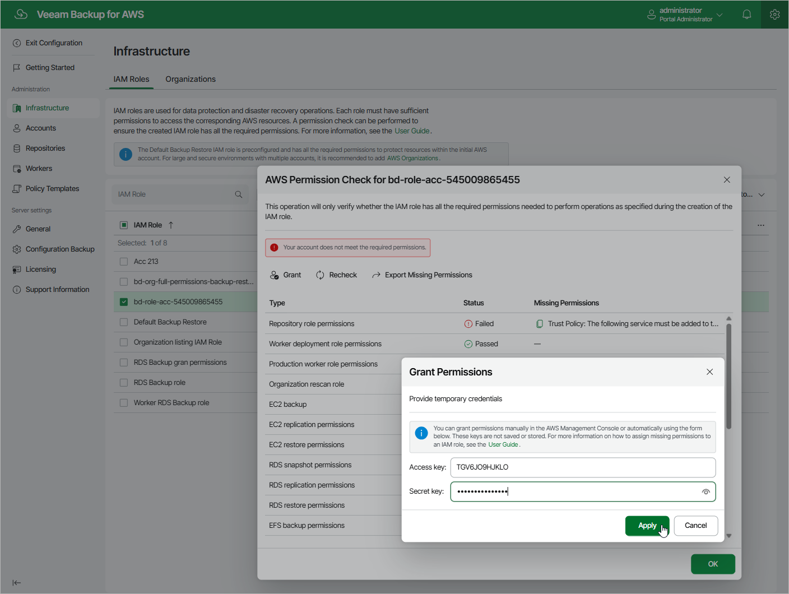

In this article

It is recommended that you check whether IAM roles specified to perform operations in Veeam Backup for AWS have all the required permissions — otherwise, the operations may fail to complete successfully. The check must be performed not only when you specify a new IAM role to perform an operation, but also after you make any changes in your AWS account and want to ensure that the permissions granted to the existing IAM roles remain sufficient.

You can verify IAM role permissions either using the built-in wizard permission check that is available when specifying roles for operations, or using the permission check at the IAM Roles tab or in the Edit IAM Role wizard.

|  |
| --- |
| Important |
| * If your organization uses service control policies (SCPs) to manage permissions in its accounts, and some of the permissions required for an operation are forbidden by these SCPs, Veeam Backup for AWS will not be able to perform the operation even if you grant the permissions to the selected IAM role. For more information on SCPs, see [AWS Documentation](https://docs.aws.amazon.com/organizations/latest/userguide/orgs_manage_policies_scps.html). * If your organization uses service control policies (SCPs) that include any conditions, Veeam Backup for AWS will not be able to perform the IAM role permission check. This is the expected behavior caused by [AWS limitations](https://docs.aws.amazon.com/IAM/latest/UserGuide/access_policies_testing-policies.html#:~:text=You%20can%27t%20test%20service%20control%20policies%20(SCPs)%20with%20any%20conditions). |

Checking IAM Role Permissions Using Wizard Functionality

To check permissions of an IAM role specified to perform an operation, navigate to the step of the wizard at which you have selected the role, and click Check Permissions. Veeam Backup for AWS will display the Permission check window where you can track the progress and view the results of the check. If some permissions of the IAM role are missing, the check will complete with errors, and the Missing Permissions column will display the list of permissions that must be granted to the IAM role. You can grant the missing permissions to the role [using the AWS Management Console](create_iam_policy.md) or instruct Veeam Backup for AWS to do it.

|  |
| --- |
| Tip |
| To download the full list of missing permissions as a single JSON policy document that you can use to grant the permissions to the role in the AWS Management Console, click Export Missing Permissions. |

To let Veeam Backup for AWS grant the missing permissions:

1. In the Permission check window, click Grant.
2. In the Grant Permissions window, provide [one-time access keys of an IAM user](https://docs.aws.amazon.com/IAM/latest/UserGuide/id_credentials_access-keys.html) that is authorized to update permissions of IAM roles, and then click Apply.

The IAM user must have the following permissions:

|  |
| --- |
| {     "Version": "2012-10-17",     "Statement": [         {             "Sid": "Statement1",             "Effect": "Allow",             "Action": [                 "iam:AttachRolePolicy",                 "iam:CreatePolicy",                 "iam:CreatePolicyVersion",                 "iam:CreateRole",                 "iam:GetAccountSummary",                 "iam:GetPolicy",                 "iam:GetPolicyVersion",                 "iam:GetRole",                 "iam:ListAttachedRolePolicies",                 "iam:ListPolicyVersions",                 "iam:SimulatePrincipalPolicy",                 "iam:UpdateAssumeRolePolicy",                 "iam:GetInstanceProfile",                 "iam:CreateInstanceProfile",                 "iam:AddRoleToInstanceProfile",                 "iam:PassRole",                 "iam:ListInstanceProfilesForRole"             ],             "Resource": [                 "\*"             ]         }     ]  } |

|  |
| --- |
| Note |
| Veeam Backup for AWS does not store one-time access keys in the configuration database. |

1. To make sure that the missing permissions have been granted successfully, click Recheck.

Checking IAM role Permissions Using IAM Roles Tab

If you are not sure whether an IAM role is currently used to perform any operations and if you want to check permission for this IAM role, you can use the permission check at the IAM Roles tab. The permission check verifies whether the IAM role has all the permissions required to perform operations with the workloads selected at the Permissions step of the Add IAM Role wizard.

To run the permission check for an IAM role, do the following:

1. Switch to the Configuration page.

1. Navigate to Infrastructure > IAM Roles.

1. Select the necessary IAM role and click Check Permissions.

You can track the progress and view the results of the permission check in the AWS Permission Check window. If some of the IAM role permissions are missing, the check will complete with errors, and the Missing Permissions column will display the list of permissions that must be granted to the IAM role. You can grant the missing permissions to the IAM role [using the AWS Management Console](https://docs.aws.amazon.com/IAM/latest/UserGuide/access_policies_manage-attach-detach.html) or instruct Veeam Backup for AWS to do it.

|  |
| --- |
| Tips |
| * To download the full list of missing permissions as a single JSON policy document that you can use to grant the permissions to the role in the AWS Management Console, click Export Missing Permissions. * To view the configured IAM role permissions at the IAM Roles tab, select the necessary IAM role and click View Permissions. |

To let Veeam Backup for AWS grant the missing permissions:

1. In the Permission check window, click Grant.
2. In the Grant Permissions window, provide [one-time access keys of an IAM user](https://docs.aws.amazon.com/IAM/latest/UserGuide/id_credentials_access-keys.html) that is authorized to update permissions of IAM roles, and then click Apply.

The IAM user must have the following permissions:

|  |
| --- |
| {     "Version": "2012-10-17",     "Statement": [         {             "Sid": "Statement1",             "Effect": "Allow",             "Action": [                 "iam:AttachRolePolicy",                 "iam:CreatePolicy",                 "iam:CreatePolicyVersion",                 "iam:CreateRole",                 "iam:GetAccountSummary",                 "iam:GetPolicy",                 "iam:GetPolicyVersion",                 "iam:GetRole",                 "iam:ListAttachedRolePolicies",                 "iam:ListPolicyVersions",                 "iam:SimulatePrincipalPolicy",                 "iam:UpdateAssumeRolePolicy",                 "iam:GetInstanceProfile",                 "iam:CreateInstanceProfile",                 "iam:AddRoleToInstanceProfile",                 "iam:PassRole",                 "iam:ListInstanceProfilesForRole"             ],             "Resource": [                 "\*"             ]         }     ]  } |

|  |
| --- |
| Note |
| Veeam Backup for AWS does not store one-time access keys in the configuration database. |

1. To make sure that the missing permissions have been granted successfully, click Recheck.

Page updated 12/2/2025

Page content applies to build 10.0.0.232
