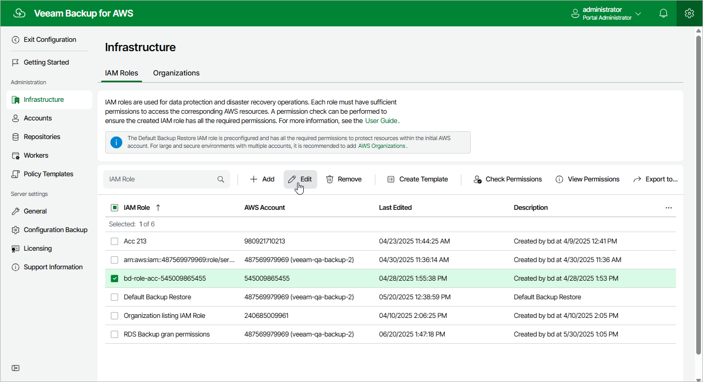

In this article

For each IAM role added to Veeam Backup for AWS, you can modify settings configured while adding the role:

1. Switch to the Configuration page.

1. Navigate to Infrastructure > IAM Roles.

1. Select the IAM role and click Edit.

1. Complete the Edit IAM Role wizard.

1. To provide a new name and description for the IAM role, follow the instructions provided in section [Adding IAM Roles](iam_roles_add_name.md) (step 2).
2. To edit the IAM role settings, follow the instructions provided in section [Adding IAM Roles](iam_roles_add_settings.md) (step 3).
3. To edit the IAM role permissions, follow the instructions provided in section [Adding IAM Roles](iam_roles_specify_permissions.md) (step 4).

When you edit the workload permissions, Veeam Backup for AWS does not automatically update the permissions already assigned to the IAM role. If you want to update these permissions, you must manually modify the IAM role in AWS Management Console as described in [AWS Documentation](https://docs.aws.amazon.com/IAM/latest/UserGuide/id_roles_manage_modify.html).

1. At the Permission check step of the wizard, Veeam Backup for AWS will verify whether the IAM role has all the permissions required to perform operations with the selected workloads.

If some of the required permissions are missing, the check will complete with errors, and the Missing Permissions column will display the list of permissions that must be granted to the IAM role. You can grant the missing permissions to the IAM role [using the AWS Management Console](create_iam_policy.md) or instruct Veeam Backup for AWS to do it, as described in section [Checking IAM Role Permissions](iam_roles_check.md#grant).

1. At the Summary step of the wizard, review summary information and click Finish to confirm the changes.

|  |
| --- |
| Important |
| After you upgrade Veeam Backup for AWS from a version prior to 7.0, the IAM Roles page will also display roles that previously existed on the backup appliance, with all actions and workload permissions available. If you want to modify the list of actions and permissions assigned to the roles, follow the instructions provided in section [Adding IAM Roles](iam_roles_specify_permissions.md) (step 4). |

Page updated 7/4/2025

Page content applies to build 10.0.0.232
