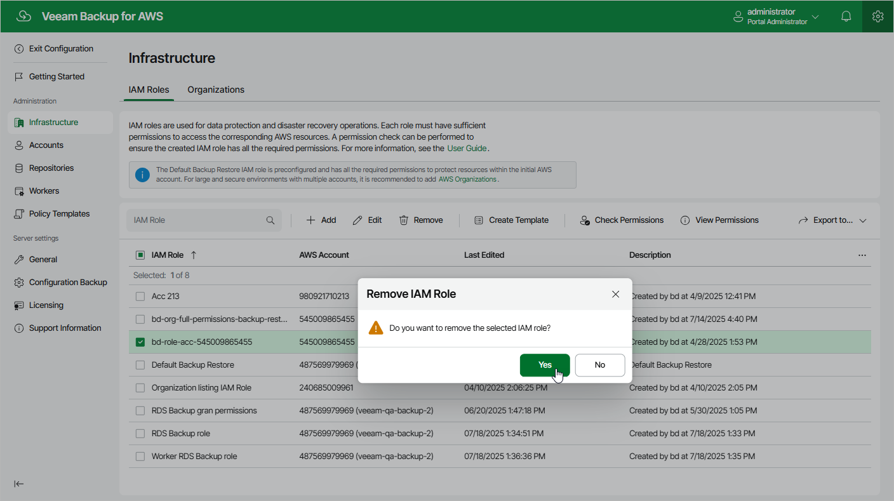

In this article

Veeam Backup for AWS allows you to permanently remove an IAM role from the configuration database if it is no longer used to perform data protection and disaster recovery operations:

1. Switch to the Configuration page.

1. Navigate to Infrastructure > IAM Roles.

1. Select the IAM role and click Remove.

1. In the Remove IAM Role window, click Yes to acknowledge the operation.

|  |
| --- |
| Important |
| You cannot remove an IAM role that is used to access backup repositories or is specified in the settings of any configured backup policy. |

Page updated 7/29/2025

Page content applies to build 10.0.0.232
