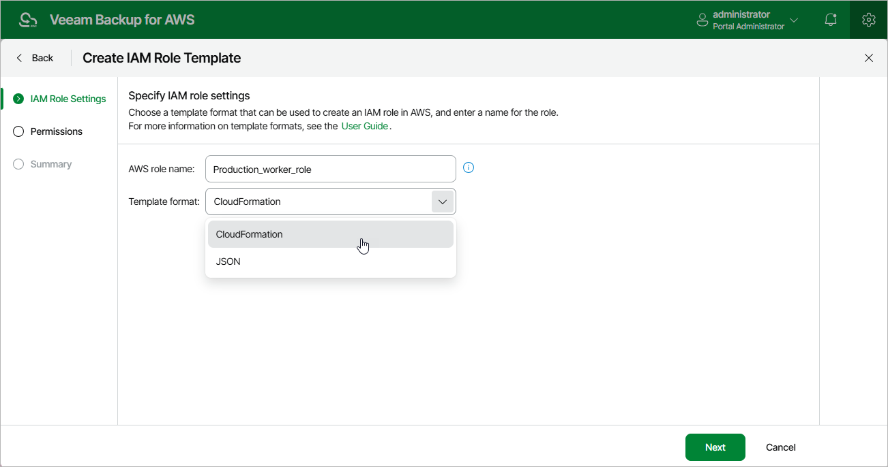

In this article

At the IAM Role Settings step of the wizard, specify the following settings:

1. In the AWS role name field, specify a name that will be assigned to the IAM role in AWS.
2. Use the Template format drop-down list to choose whether you want the template to be exported to a CloudFormation template or a JSON policy document:

* Select the CloudFormation option to export the created template to a .CFORM file. You can further upload the file to the CloudFormation service and use it to create the necessary IAM role automatically, as described in [AWS Documentation](https://docs.aws.amazon.com/AWSCloudFormation/latest/UserGuide/Welcome.html).
* Select the JSON option to export the created template to a .JSON file. You can further use the file to create IAM policies in the IAM console and attach the policies to the necessary IAM role manually, as described in [Appendix A. Creating IAM Roles in AWS](create_iam_policy_role.md) and [Appendix B. Creating IAM Policies in AWS](create_iam_policy.md).

Page updated 7/4/2025

Page content applies to build 10.0.0.232
