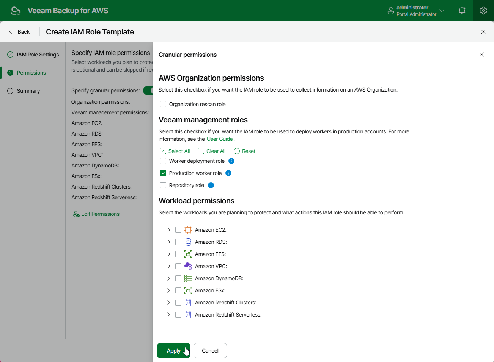

In this article

At the Permissions step of the wizard, you can define specific operations that Veeam Backup for AWS will be able to perform using the permissions of the created IAM role. To do that:

1. Set the Specify granular permissions toggle to On.
2. In the AWS Organization permissions section, select the Organization rescan role check box if you want to create an IAM role whose permissions will be used to collect information on the AWS Organization you want to add to Veeam Backup for AWS.

The specified role must be created in the AWS account that manages the AWS Organization.

1. In the Veeam management roles section, choose actions that will be performed using the IAM role:

* Worker deployment role — will be used to deploy worker instances in the [backup account](worker_options.md#backup).
* Production worker role — will be used to communicate with worker instances in [production accounts](worker_settings.md).
* Repository role — will be used to create new repositories in Amazon S3 buckets and to further access the repositories during data protection and disaster recovery operations.

1. In the Workload permissions section, choose resources that will be protected using the IAM role, and operations that will be performed with these resources:

* Backup — Veeam Backup for AWS will protect EC2, Redshift, DynamoDB, EFS, FSx and VPC resources.

Note that the list of permissions for this role will also contain additional permissions required to deploy worker instances in production accounts during EFS indexing and EC2 backup operations.

* Replication — Veeam Backup for AWS will replicate cloud-native snapshots of EC2 and RDS resources.
* Snapshot — Veeam Backup for AWS will create cloud-native snapshots of RDS resources.

Note that the list of permissions for this role will also contain additional permissions required to deploy worker instances in production accounts during RDS backup operations.

* Restore — Veeam Backup for AWS will restore EC2, RDS, Redshift, DynamoDB, EFS, FSx and VPC resources.

Note that the list of permissions for this role will also contain additional permissions required to deploy worker instances in production accounts during EC2 and RDS restore operations.

Keep in mind that all the required permissions will be added to the created template and automatically assigned to the role when creating it in AWS.

|  |
| --- |
| Note |
| Note that if you do not specify any management roles and resource permissions for the IAM role at this step, all the listed action and resource operations will be selected for the role automatically. |

Page updated 7/4/2025

Page content applies to build 10.0.0.232
