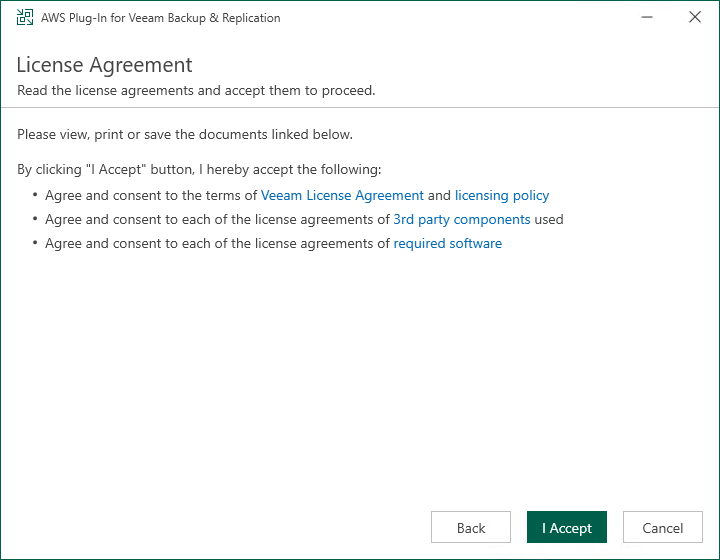

In this article

If your installation package of Veeam Backup & Replication does not provide features that allow you to protect AWS resources, you must install Veeam Plug-In for AWS on the backup server to be able to add your backup appliances to the backup infrastructure.

|  |
| --- |
| Note |
| Before you install Veeam Plug-In for AWS, stop all running backup policies, disable all jobs, and close the Veeam Backup & Replication console. |

To install Veeam Plug-In for AWS, do the following:

1. Log in to the backup server using an account with the local Administrator permissions.
2. In a web browser, navigate to the [Veeam Backup & Replication: Download](https://www.veeam.com/backup-replication-vcp-download.html.) page, switch to the Cloud Plug-ins in the Additional Downloads section, and click the Download icon to download Veeam Plug-In for AWS.
3. Open the downloaded AWSPlugin\_13.10.0.225.zip file and launch the AWSPlugin\_13.10.0.225.zip installation file.
4. Complete the AWS Plug-In for Veeam Backup & Replication Setup wizard:

1. At the License Agreements step, read and accept the Veeam license agreement and licensing policy, as well as the license agreements of 3rd party components that Veeam incorporates, and the license agreements of required software. If you reject the agreements, you will not be able to continue installation.
2. At the Installation Path step of the wizard, you can specify the installation directory. To do that, click Browse. In the Browse for folder window, select the installation directory for the product or create a new one, and click OK.

1. At the Ready to Install step, click Install to begin installation.

Related Topics

* [Installing and Uninstalling Plug-In in Unattended Mode](install_unattended.md)
* [Upgrading Plug-In](upgrading_plugin.md)
* [Uninstalling Plug-In](uninstall_plugin.md)

Page updated 11/20/2025

Page content applies to build 10.0.0.232
