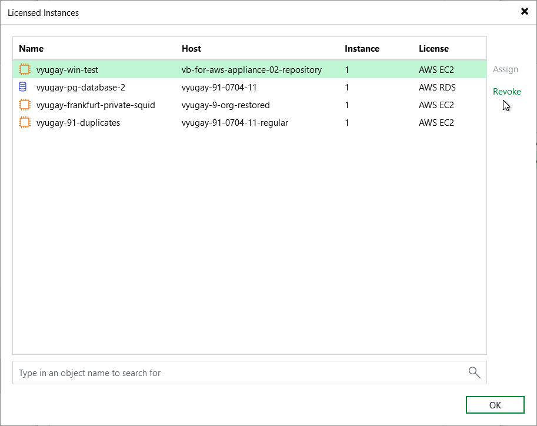
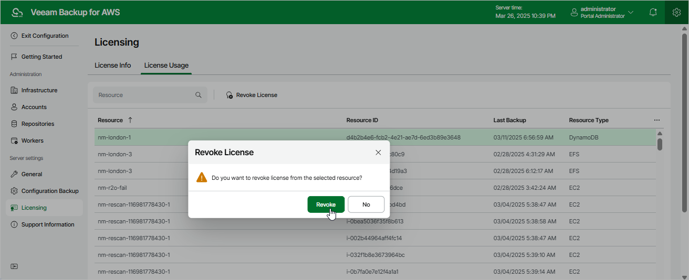

In this article

By default, Veeam Backup for AWS automatically revokes a license unit from a protected instance if no new restore points have been created by the backup policy during the past 31 days. However, you can manually revoke license units from protected instances — this can be helpful, for example, if you remove a number of instances from a backup policy and do not want to protect them anymore.

Revoking License Units Using Veeam Backup & Replication Console

To revoke a license unit from a protected instance in the Veeam Backup & Replication console, do the following:

1. In the Veeam Backup & Replication console, open the main menu and select License.
2. In the License Information window, switch to the Instances tab and click Manage.

1. In the Licensed Instances window, select a protected workload and click Revoke. Veeam Backup & Replication will revoke a license unit from the selected workload.

Revoking License Units Using Veeam Backup for AWS Web UI

To revoke a license unit from a protected instance in the Veeam Backup for AWS Web UI, do the following:

1. Switch to the Configuration page.
2. Navigate to Licensing > License Usage.
3. Select the instance that you no longer want to protect.
4. Click Revoke License.
5. In the Revoke License window, click Yes to confirm that you want to revoke the license unit.

Page updated 7/8/2025

Page content applies to build 10.0.0.232
