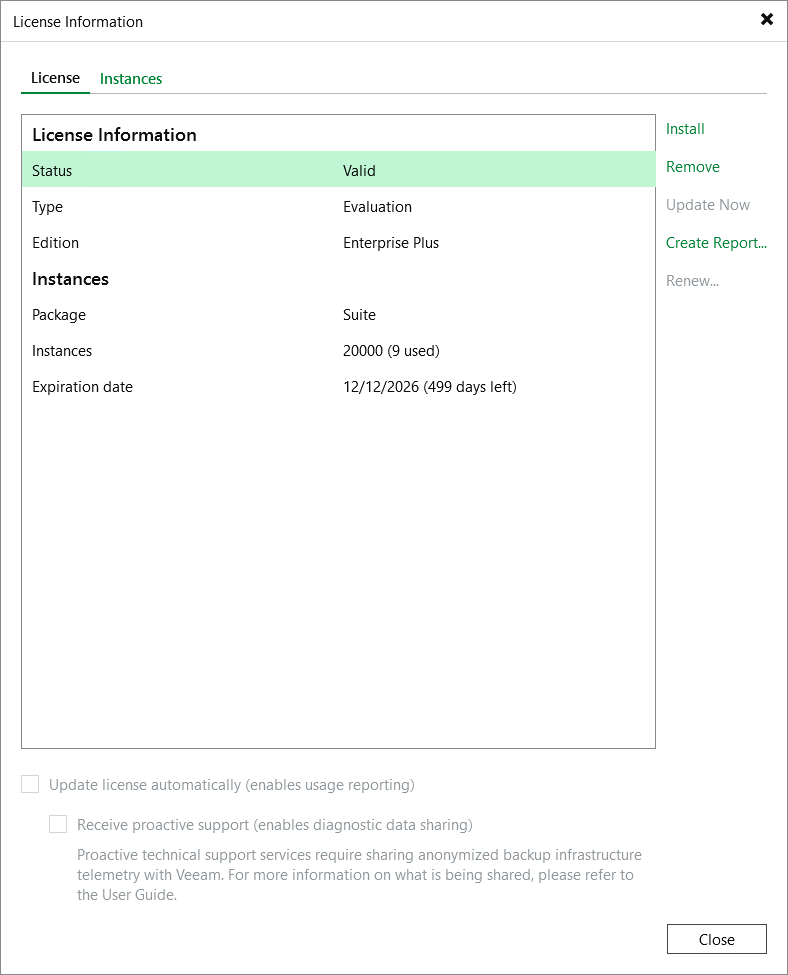
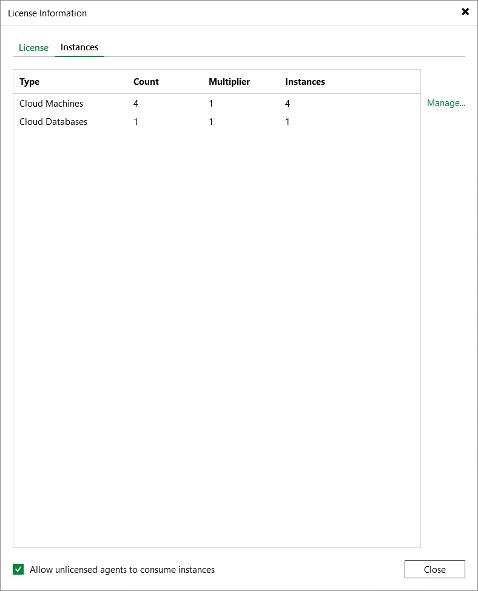
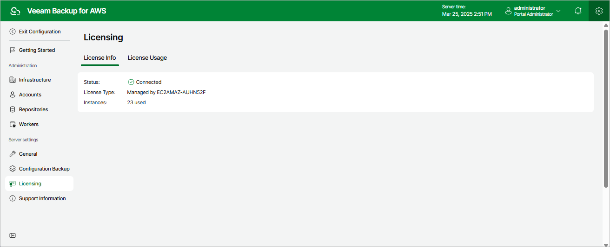

In this article

After you add a backup appliance to the backup infrastructure, you can view the number of protected workloads in the Veeam Backup & Replication console.

Viewing License Details Using Veeam Backup & Replication Console

To view Veeam Plug-In for AWS license details in the Veeam Backup & Replication console, open the main menu and select License.

The License tab of the License Information window provides general information on the currently installed Veeam Plug-In for AWS license:

* Status — the license status. The status will depend on the license type, the number of days remaining until license expiration, the number of days remaining in the grace period (if any), and the number of workloads that exceeded the allowed increase limit (if any).
* Type — the license type (Perpetual, Subscription, Rental, Evaluation, NFR, Free).
* Edition — the license edition (Community, Standard, Enterprise, Enterprise Plus).
* Support ID — the ID of the contract (required for contacting Veeam Customer Support).
* Licensed to — the name of an organization to which the license was issued.
* Package — the software product for which the license was issued.
* Instances — the total number of license units included in the license file and the number of units consumed by protected workloads.
* Support expiration date — the date when the license will expire.

The Instances tab of the License Information window provides information on the currently protected workloads:

* Type — the type of protected workloads.

* Cloud VMs — protected EC2 instances.
* Cloud Databases — protected RDS resources, Aurora DB clusters, DynamoDB tables, Redshift clusters and Redshift Serverless namespaces.
* Cloud File Shares — protected EFS and FSx file systems.

* Count — the number of protected workloads.
* Multiplier — the number of license units one protected workload consumes.
* Instances — the total number of the consumed license units.

Viewing License Details Using Veeam Backup for AWS Web UI

To view details on the license that is currently installed on the backup appliance in the Veeam Backup for AWS Web UI, do the following:

1. Switch to the Configuration page.
2. Navigate to Licensing > License Info.

The licensing section provides general information on the Veeam Backup for AWS license:

* Status — the license status. The status depends on the license edition, the number of days remaining until license expiration and the number of days remaining in the grace period (if any).
* License Type — the license edition (Free, Managed).
* Instances — the total number of license units included in the license file and the number of units consumed by protected resources.

Each instance that has a restore point created in the past 31 days is considered to be protected and consumes 1 license unit. To view the list of instances that consume license units, switch to the License Usage tab.

|  |
| --- |
| Important |
| Starting from Veeam Backup for AWS version 9, installing licenses is not supported for backup appliances that are not managed by any Veeam Backup & Replication servers. As a workaround, [install Veeam Plug-In for AWS on a backup server](deployment.md) and [add the appliance](connect_appliance.md) to the backup infrastructure. |

Related Topics

[Revoking License Units](lic_revoke.md)

Page updated 9/2/2025

Page content applies to build 10.0.0.232
