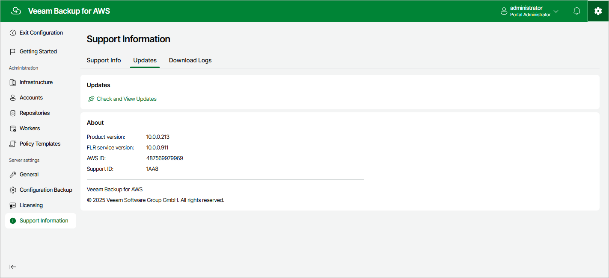
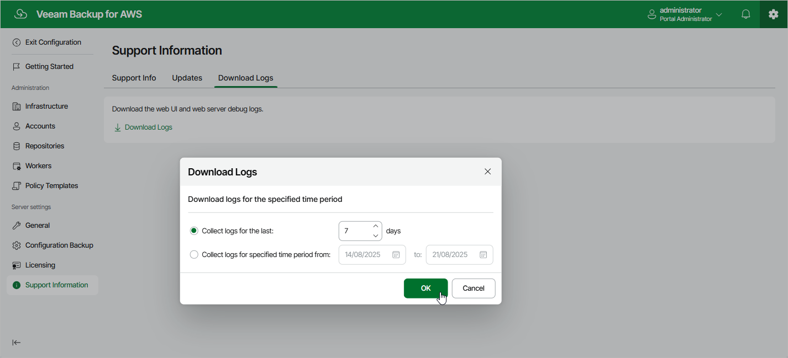
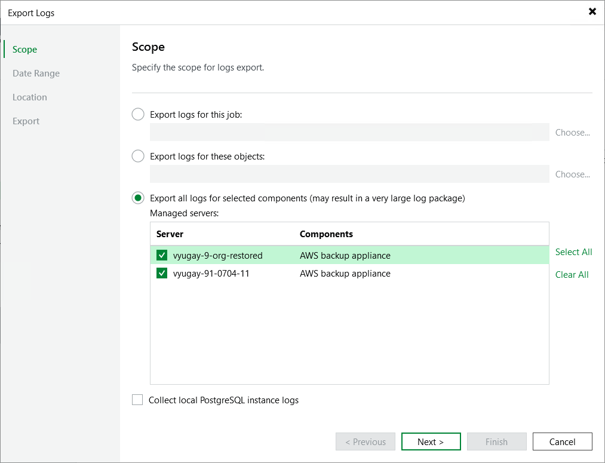

In this article

If you have any questions or issues with Veeam Backup for AWS, you can search for a resolution on [Veeam R&D Forums](https://forums.veeam.com/) or submit a support case in the [Veeam Customer Support Portal](https://www.veeam.com/support.html).

When you submit a support case, it is recommended that you provide the Veeam Customer Support Team with the following information:

* [Version information for the product and its infrastructure components](#about)
* The error message or an accurate description of the problem you are facing
* [Log files](#logs)

For information on Veeam Technical Support Tiers, SLAs and coverage, see the [Veeam Customer Support Policy](https://www.veeam.com/support-policy.html).

Viewing Product Details Using Web UI

To view the product details:

1. Switch to the Configuration page.
2. Navigate to Support Information.

The About section of the Updates tab displays the following information:

* Product version — the currently installed version of Veeam Backup for AWS.
* FLR service version — the currently installed version of the File-level recovery service.
* AWS ID — the unique identification number of the AWS account where Veeam Backup for AWS is installed.
* Support ID — the unique identification number of the Veeam support contract.

Downloading Product Logs Using Web UI

To download the product logs, do the following:

1. Switch to the Download Logs tab.
2. Click Download Logs.
3. In the Download Logs window, specify a time interval for which logs must be collected:

* Select the Collect logs for the last option if you want to collect data for a specific number of days in the past.

* Select the Collect logs for specified time period option if you want to collect data for a specific period of time in the past.

1. Click OK.

Veeam Backup for AWS will collect logs for the specified time interval and save them to the default download folder on the local machine in a single log.zip archive.

Downloading Product Logs Using Veeam Backup & Replication Console

To export the product logs, do the following:

1. In the Veeam Backup & Replication console, open the main menu and navigate to Help > Support Information.
2. In the Export Logs wizard, do the following:

1. At the Scope step, select the Export all logs for selected components option. Then, in the Managed servers list, select the backup server, backup appliances and other components for which you want to export logs.
2. Complete the wizard as described in the Veeam Backup & Replication User Guide, section [Export Logs](https://helpcenter.veeam.com/docs/vbr/userguide/export_logs_date.html?ver=13).

Page updated 11/6/2025

Page content applies to build 10.0.0.232
