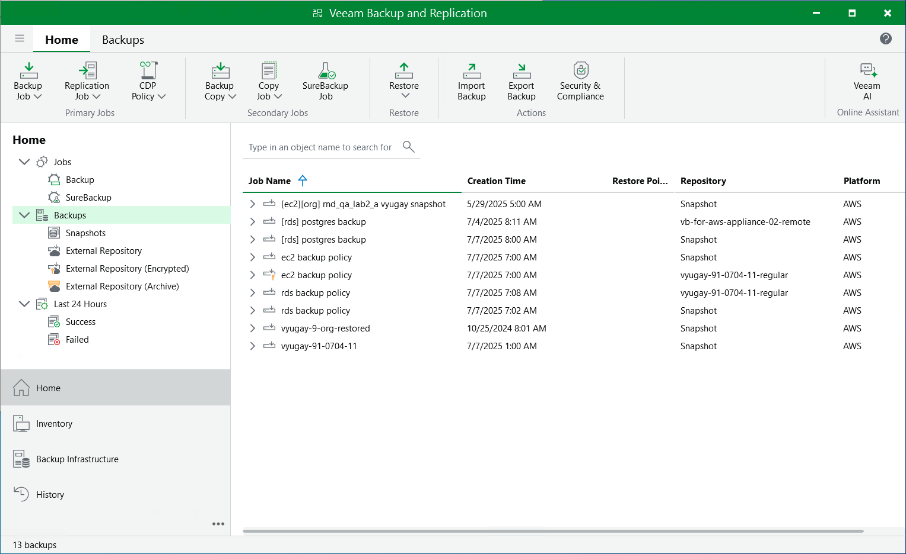
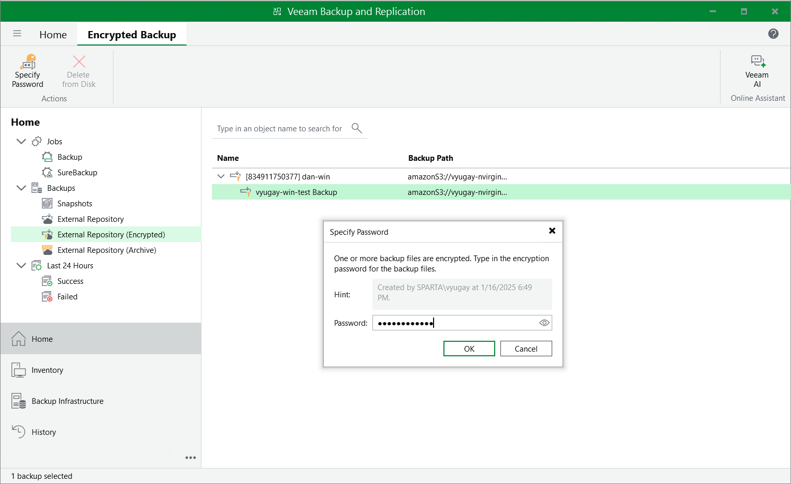

In this article

To view and manage backed-up data, navigate to the Backups node of the Home view. The node displays information on all restore points created by backup appliances.

|  |
| --- |
| Note |
| You cannot remove created image-level backups and snapshots from the Veeam Backup & Replication console. To remove restore points of EC2 instances, RDS resources, DynamoDB tables, Redshift clusters, Redshift Serverless namespaces, EFS file systems, FSx file systems and VPC configurations, open the backup [appliance Web UI](access_vb_console.md) and follow the instructions provided in section [Managing Backed-up Data using Web UI](managing_data_ui.md). |

When you expand the Backups node in the working area, you can see the following icons:

| Icon | Protected Workload |
| --- | --- |
|  | Indicates that the protected workload is an EC2 instance. |
|  | Indicates that the protected workload is an DB instance. |
|  | Indicates that the protected workload is an Aurora DB cluster. |
|  | Indicates that the protected workload is a DynamoDB table. |
|  | Indicates that the protected workload is a Redshift cluster or a Redshift Serverless namespace. |
|  | Indicates that the protected workload is an EFS file system. |
|  | Indicates that the protected workload is an FSx file system. |
|  | Indicates that the protected workload is a VPC configuration. |

The Backups node contains 4 subnodes:

* The Snapshots subnode displays information on cloud-native snapshots of the protected EC2 instances and RDS resources, as well as information on cloud-native backups of the protected Redshift clusters, Redshift Serverless namespaces, DynamoDB tables, EFS and FSx file systems:

* <appliance\_name> nodes show snapshots or backups created manually on backup appliances and snapshots or backups imported to the backup appliances from AWS Regions specified in backup policy settings.
* <backup\_policy\_name> nodes show snapshots or backups created by backup policies.

To learn how Veeam Backup for AWS creates cloud-native snapshots of EC2 instances and RDS resources, as well as cloud-native backups of DynamoDB tables, Redshift clusters, Redshift Serverless namespaces, EFS file systems and FSx file systems, see sections [EC2 Backup](backup_hiw_ec2.md), [RDS Backup](backup_hiw_rds.md), [DynamoDB Backup](backup_hiw_dynamo.md), [Redshift Backup](backup_hiw_redshift.md), [Redshift Serverless Backup](backup_hiw_redshift_serverless.md), [EFS Backup](backup_hiw_efs.md) and [FSx Backup](backup_hiw_fsx.md).

* The External Repository subnode displays information on image-level backups of the protected EC2 instances and RDS resources that are stored in standard backup repositories, as well as backups of VPC configurations that are stored on backup appliances.

* <backup\_policy\_name> nodes show backups of EC2 instances and RDS resources created by backup policies.
* <aws\_account\_name> nodes show VPC configuration backups created for specific AWS accounts.

To learn how Veeam Backup for AWS creates image-level backups of EC2 instances and RDS resources, as well as VPC configuration backups, see sections [EC2 Backup](backup_hiw_ec2.md), [RDS Backup](backup_hiw_rds.md) and [VPC Configuration Backup](backup_hiw_vpc.md).

|  |
| --- |
| Note |
| If a backup chain was originally encrypted and then got decrypted by Veeam Backup & Replication, the backup chain will be marked with the Key icon. |

* The External Repository (Encrypted) subnode displays information on encrypted image-level backups of EC2 instances and RDS resources that are stored in standard backup repositories and that have not been decrypted yet, which means either that you have not specified the decryption password or that the specified password is invalid.

To learn how to decrypt backups, see [Decrypting Backups](#decrypt_backups).

* The External Repository (Archive) subnode displays information on image-level backups of EC2 instances and RDS resources that are stored in archive backup repositories.

To learn how Veeam Backup for AWS creates archive backups, see [EC2 Archive Backup Chain](archive_chain.md) and [RDS Archive Backup Chain](archive_chain_rds.md).

Decrypting Backups

Veeam Backup & Replication automatically decrypts backup files stored in repositories either using passwords that you specify when adding these repositories to the backup infrastructure or using KMS keys automatically detected by Veeam Backup & Replication. If you do not specify decryption passwords or if Veeam Backup & Replication does not have permissions to access KMS keys, the backup files remain encrypted.

* To decrypt backup files encrypted using a KMS key, make sure that the IAM user specified when [creating a new repository](add_s3_account.md) or [adding an existing repository](connect_appliance_repo.md) is assigned permissions required to access KMS keys. For more information on the required permissions, see [Plug-in Permissions](req_permissions.md#kms_permissions).
* To decrypt backup files encrypted using a password, do the following:

1. In the Veeam Backup & Replication console, open the Home view.
2. Navigate to Backups > External Repository (Encrypted).
3. Expand the backup policy that protects an AWS resource whose image-level backup you want to decrypt, select the backup chain that belongs to the resource and click Specify Password on the ribbon.

Alternatively, you can right-click the necessary backup chain and select Specify password.

|  |
| --- |
| Tip |
| To decrypt all backups created by a backup policy, right-click the policy and select Specify Password. |

1. In the Specify Password window, enter the password that was used to encrypt the data stored in the target repository.

Page updated 9/29/2025

Page content applies to build 10.0.0.232
