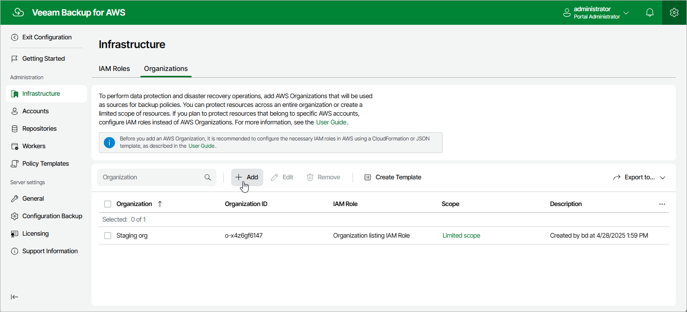

# Step 1. Launch Add Organization Wizard

To launch the Add Organization wizard, do the following:

1. Switch to the Configuration page.

1. Navigate to Infrastructure > Organizations.

1. Click Add.

