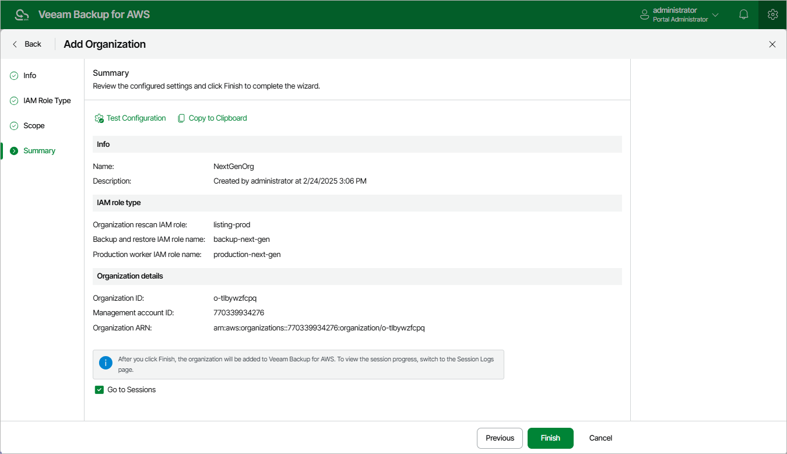

In this article

At the Summary step of the wizard, review configuration information and check whether the specified Organization rescan IAM role has all the required permissions, as well as whether the Backup and restore IAM role and Production worker IAM role exist in all AWS accounts within the organization — to do that, click Test Configuration. Veeam Backup for AWS will display the Test organization configuration window where you can track the progress and view the results of the configuration check. If some permissions of the Organization rescan IAM role are missing, the check will complete with errors. You can grant the missing permissions to the IAM role using the AWS Management Console or [instruct Veeam Backup for AWS to do it](iam_roles_check.md). To learn how to grant permissions to IAM roles using the AWS Management Console, see [Appendix B. Creating IAM Policies in AWS](create_iam_policy.md).

After the required permissions are granted, close the Test organization configuration window and review configuration information. Then, choose whether you want to proceed to the [Sessions page](reporting.md#ui) to track the progress of adding the organization, and click Finish.

Page updated 12/9/2025

Page content applies to build 10.0.0.232
