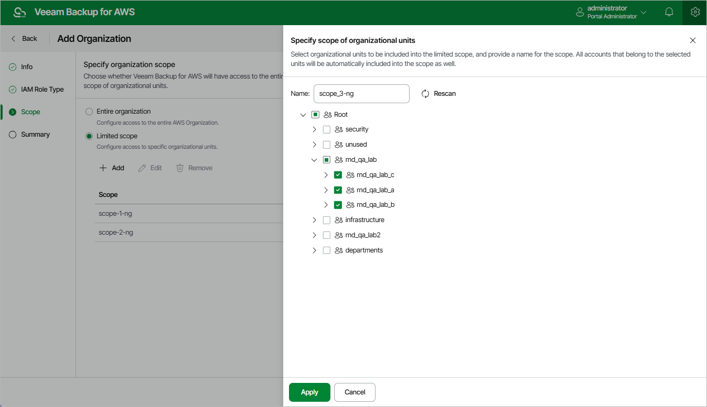

In this article

At the Scope step of the wizard, choose whether you want Veeam Backup for AWS to have full or limited access to resources within the AWS Organization.

If you select the Limited scope option, you must also specify the scope explicitly — select organizational units containing resources that you plan to protect. To do that, click Add; then, select the necessary units to include in the scope and provide a unique name for it in the Specify scope of organizational units window.

|  |
| --- |
| Tips |
| * If the list of available organizational units does not show the units that you want to include, click Rescan to launch the data collection process. As soon as the process is over, Veeam Backup for AWS will update the unit list. * You can specify multiple scopes to enable configuration flexibility while applying different data protection scenarios for resources from different organizational units. |

After you define the organization scope (either an entire AWS Organization or a limited scope of organizational units), you will be able to specify this scope while creating backup policies and completing restore wizards to allow Veeam Backup for AWS to perform data protection and disaster recovery operations. For more information, see sections [Performing Backup](performing_backup_web_ui.md) and [Performing Restore](recovery.md).

Page updated 7/25/2025

Page content applies to build 10.0.0.232
