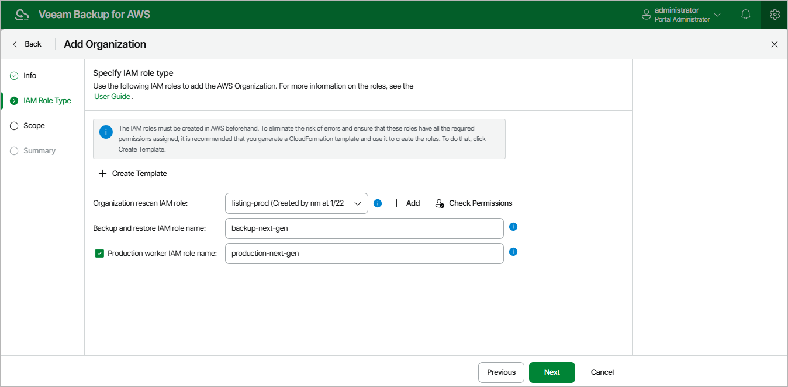

In this article

At the IAM Roles step of the wizard, do the following:

1. From the Organization rescan IAM role drop-down list, select an IAM role whose permissions will be used to collect information on the AWS Organization. The selected role must belong to the AWS account that is used to manage the AWS Organization (that is, the [management account](https://docs.aws.amazon.com/organizations/latest/userguide/orgs_getting-started_concepts.html#management-account) or a [delegated administrator account](https://docs.aws.amazon.com/organizations/latest/userguide/orgs_getting-started_concepts.html#delegated-admin)) — you must create the role in AWS beforehand either [using a CloudFormation template or a JSON policy document](organization_template_add.md).

For an IAM role to be displayed in the list of available roles, it must be added to Veeam Backup for AWS with the Organization rescan role selected, as described in section [Adding IAM Roles](iam_roles_add.md). If you have not added the IAM role to the Veeam Backup for AWS beforehand, you can do it without closing the Add Organization wizard. To do that, click Add and complete the Add IAM Role wizard.

|  |
| --- |
| Important |
| It is recommended that you check whether the selected IAM role has all the permissions required to perform rescan operations. If some permissions of the IAM role are missing, Veeam Backup for AWS will fail to collect information on the organization and your data will be unprotected. To run the IAM role permission check, click Check Permissions and follow the instructions provided in section [Checking IAM Role Permissions](iam_roles_check.md#wizard). For more information on the required permissions, see [Organization Rescan IAM Permissions](organization_permissions.md). |

1. In the Backup and restore IAM role name field, enter the name (as specified in AWS) of an IAM role whose permissions will be used to access AWS services and resources, and to perform backup and restore operations. The role must exist in each AWS account that contains resources you plan to protect within the AWS Organization — you must create the role in AWS beforehand either [using a CloudFormation template or a JSON policy document](organization_template_add.md).
2. In the Production worker IAM role name field, enter the name (as specified in AWS) of an IAM role whose permissions will be used for communication between the backup appliance and worker instances deployed in [production accounts](worker_options.md#production). The role will be attached to the worker instances to index EFS file systems, and to perform operations with EC2 and RDS resources within the AWS Organization.

The role must exist in each AWS account that contains resources you plan to protect within the AWS Organization — you must create the role in AWS beforehand either [using a CloudFormation template or a JSON policy document](organization_template_add.md).

If you do not enter a Production worker IAM role name, Veeam Backup for AWS will use permissions of the Backup and restore IAM role both to deploy worker instances in production accounts and to communicate with these instances. In this case, it is recommended that you make sure that the Backup and restore IAM role has additional permissions listed in section [Worker Deployment Options](worker_options.md#roles).

|  |
| --- |
| Tip |
| If you have not created the necessary IAM role in AWS beforehand, you can do it without closing the Add Organization wizard. To do that, click Create Template and complete the Create IAM Roles Template wizard as described in section [Creating IAM Roles Template for AWS Organization](organization_template_add.md). |

Page updated 12/9/2025

Page content applies to build 10.0.0.232
