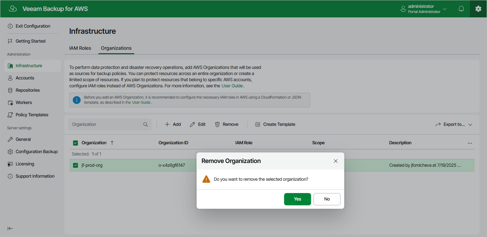

In this article

Veeam Backup for AWS allows you to permanently remove an AWS Organization from the configuration database if it is no longer used to perform data protection and disaster recovery operations:

1. Switch to the Configuration page.

1. Navigate to Infrastructure > Organizations.

1. Select the AWS Organization and click Remove.

1. In the Remove Organization window, click Yes to acknowledge the operation.

|  |
| --- |
| Important |
| You cannot remove an AWS Organization or limited scope of organizational units that are specified in the settings of any configured backup policy. |

Page updated 8/20/2025

Page content applies to build 10.0.0.232
