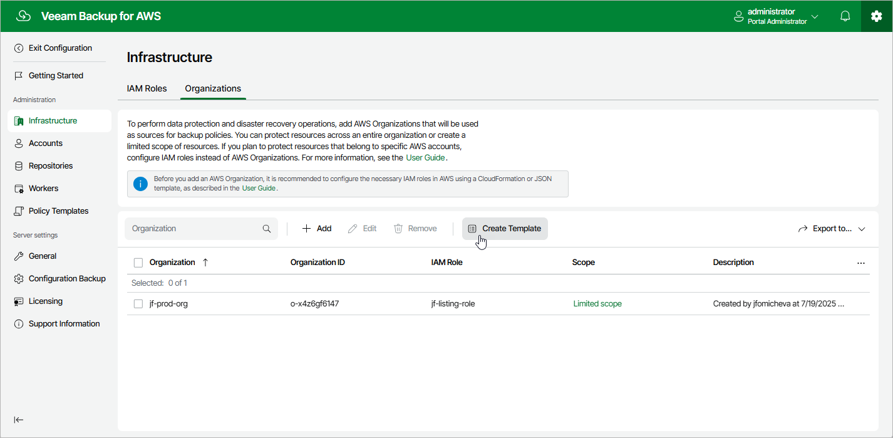

In this article

To launch the Create IAM Roles Template wizard, do the following:

1. Switch to the Configuration page.

1. Navigate to Infrastructure > Organizations.

1. Click Create Template.

Page updated 8/20/2025

Page content applies to build 10.0.0.232
