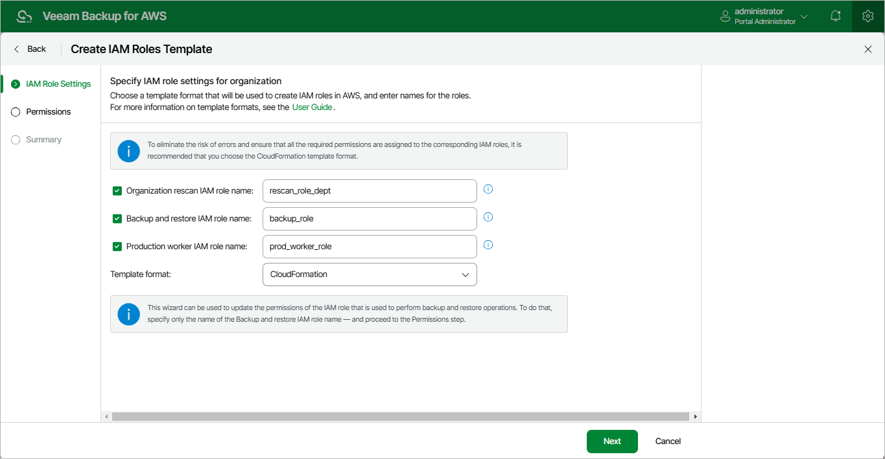

In this article

At the IAM Role Settings step of the wizard, choose IAM roles that will be created based on the template. To do that, select check boxes next to the necessary roles and enter names that will be assigned to these roles in AWS.

Veeam Backup for AWS allows you to create the following roles:

* Organization rescan IAM role — permissions of this role will be used to collect information on the AWS Organization you want to add to Veeam Backup for AWS.

If you select the Organization rescan IAM role name check box, Veeam Backup for AWS will automatically generate a file with all the required role permissions. However, you will have to manually create the role in the AWS account that is used to manage the organization (that is, [management account](https://docs.aws.amazon.com/organizations/latest/userguide/orgs_getting-started_concepts.html#management-account) or a [delegated administrator account](https://docs.aws.amazon.com/organizations/latest/userguide/orgs_getting-started_concepts.html#delegated-admin)).

* Backup and restore IAM role — permissions of this role will be used to access AWS services and resources within the AWS Organization, and to perform backup and restore operations with resources of the organization.

If you select the Backup and restore IAM role name check box, Veeam Backup for AWS will automatically generate a file with all the required role permissions. However, you will have to manually create the role in each AWS account that contains resources you plan to protect within the organization.

Keep in mind that you will have to choose whether you want to specify granular permissions for the role at [step 3](organization_template_specify_permissions.md) of the wizard.

* Production worker IAM role — permissions of this role will be used for communication between the backup appliance and worker instances deployed in [production accounts](worker_options.md#production). The role will be attached to the worker instances to index EFS file systems, and to perform operations with EC2 and RDS resources within the AWS Organization.

If you select the Production worker IAM role name check box, Veeam Backup for AWS will automatically generate a file with all the required role permissions. However, you will have to manually create the role in each AWS account that contains resources you plan to protect within the organization.

|  |
| --- |
| Note |
| If you do not select the Production worker IAM role name check box and then do not specify the Production worker IAM role in the [organization settings](organization_add_settings.md), Veeam Backup for AWS will use permissions of the Backup and restore IAM role both to deploy worker instances in production accounts and to communicate with these instances. |

Veeam Backup for AWS also allows you to choose whether you want the template to be exported to a CloudFormation template or a JSON policy document:

* Select the CloudFormation option to export the created template to a .CFORM file. You can further upload the file to the AWS CloudFormation service and use it to create the necessary IAM roles automatically, as described in [AWS Documentation](https://docs.aws.amazon.com/AWSCloudFormation/latest/UserGuide/Welcome.html).
* Select the JSON option to export the created template to a .JSON file. You can further use the file to create IAM policies in the IAM console and attach the policies to the necessary IAM roles manually, as described in [Appendix A. Creating IAM Roles in AWS](create_iam_policy_role.md) and [Appendix B. Creating IAM Policies in AWS](create_iam_policy.md).

Page updated 11/28/2025

Page content applies to build 10.0.0.232
