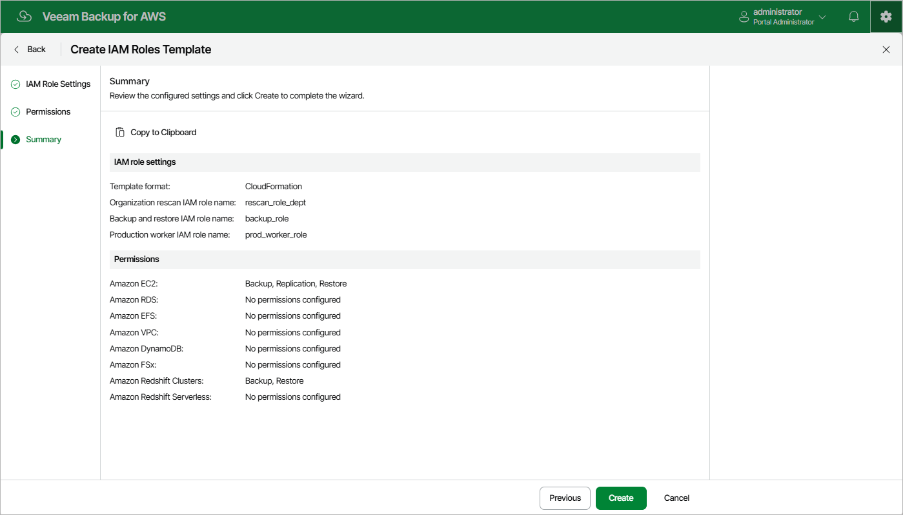

In this article

At the Summary step of the wizard, review configuration information. After you click Create, Veeam Backup for AWS will generate a separate .CFORM or a .JSON file for each specified IAM role (depending on the settings configured at [step 2](organization_template_add_name.md) of the wizard) and save it locally in the default download folder.

Page updated 11/28/2025

Page content applies to build 10.0.0.232
