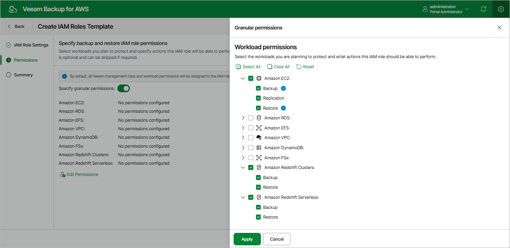

In this article

[This step applies only if you have selected the Backup and restore IAM role name check box at the IAM Role Settings step of the wizard]

At the Permissions step of the wizard, you can define specific operations that Veeam Backup for AWS will be able to perform using the permissions of the created IAM role:

1. Set the Specify granular permissions toggle to On.
2. [Applies only if you have not specified the Production worker IAM role at [step 2](organization_template_add_name.md) of the wizard]

If you want to use the Backup and restore IAM role to deploy worker instances in production accounts, select the Production worker role check box in the Veeam management roles section. This role can be then attached to the worker instances and used by Veeam Backup for AWS to communicate with these instances deployed to index EFS file systems, and to perform operations with EC2 and RDS resources of the organization.

1. In the Workload permissions section, choose resources that will be protected using the IAM role, and operations that will be performed with these resources:

* Backup — Veeam Backup for AWS will protect EC2, Redshift, DynamoDB, EFS, FSx and VPC resources.

Note that the list of permissions for this role will also contain additional permissions required to deploy worker instances in production accounts.

* Replication — Veeam Backup for AWS will replicate cloud-native snapshots of EC2 and RDS resources.
* Snapshot — Veeam Backup for AWS will create cloud-native snapshots of RDS resources.

Note that the list of permissions for this role will also contain additional permissions required to deploy worker instances in production accounts.

* Restore — Veeam Backup for AWS will restore EC2, RDS, Redshift, DynamoDB, EFS, FSx and VPC resources.

Note that the list of permissions for this role will also contain additional permissions required to deploy worker instances in production accounts.

Note that if you do not specify any management role and resource permissions for the IAM role at this step, all the listed resource operations will be selected for the role automatically.

Page updated 7/25/2025

Page content applies to build 10.0.0.232
