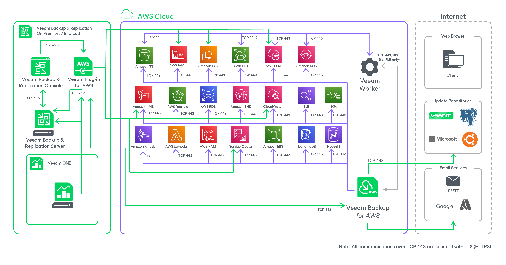

In this article

The Veeam Backup for AWS architecture includes the following components:

* [Backup server](backup_server.md)
* [AWS Plug-in for Veeam Backup & Replication](aws_plugin.md)
* [Backup appliances](backup_appliances.md)
* [Backup repositories](backup_repositories.md)

* [Worker instances](worker_instances.md)
* [Additional repositories and tape devices](additional_repos_and_tape_devices.md#tape_devices)
* [Gateway servers](gateway_servers.md)

Page updated 12/9/2025

Page content applies to build 10.0.0.232
