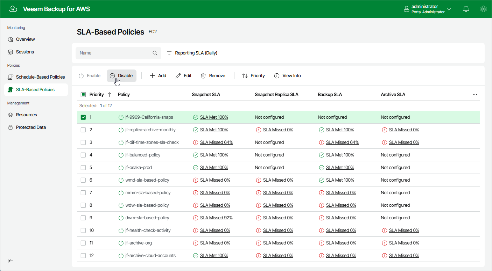

In this article

By default, Veeam Backup for AWS runs all created backup policies according to the specified schedules. However, you can temporarily disable a backup policy so that Veeam Backup for AWS does not run the backup policy automatically. You will still be able to [manually start](policies_start_stop.md) or enable the disabled backup policy at any time you need.

To enable or disable a backup policy, do the following:

1. Navigate to Policies.
2. Switch to the necessary tab and select the backup policy.

1. Click Disable or Enable.

|  |
| --- |
| Note |
| Disabling a backup policy does not affect the retention settings configured for the cloud-native snapshots, image-level and archived backups created by the policy. Veeam Backup for AWS will continue running retention sessions for the disabled backup policy and removing restore points according to the configured settings. |

Page updated 8/6/2025

Page content applies to build 10.0.0.232
