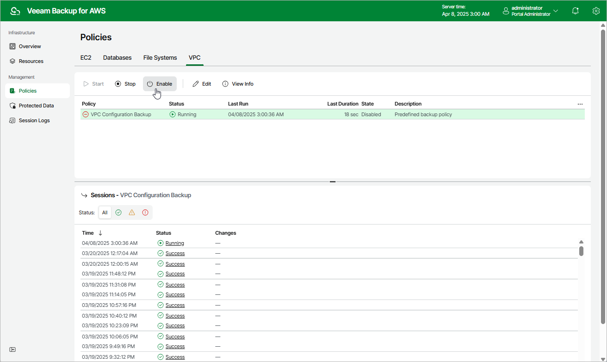

In this article

By default, Veeam Backup for AWS comes with the disabled VPC Configuration Backup Policy. You can [manually start](policies_start_stop_vpc.md) or enable the disabled backup policy at any time you need.

To enable or disable the VPC Configuration Backup policy, do the following:

1. Navigate to Policies > VPC.
2. Click Enable or Disable.

Page updated 4/7/2025

Page content applies to build 10.0.0.232
