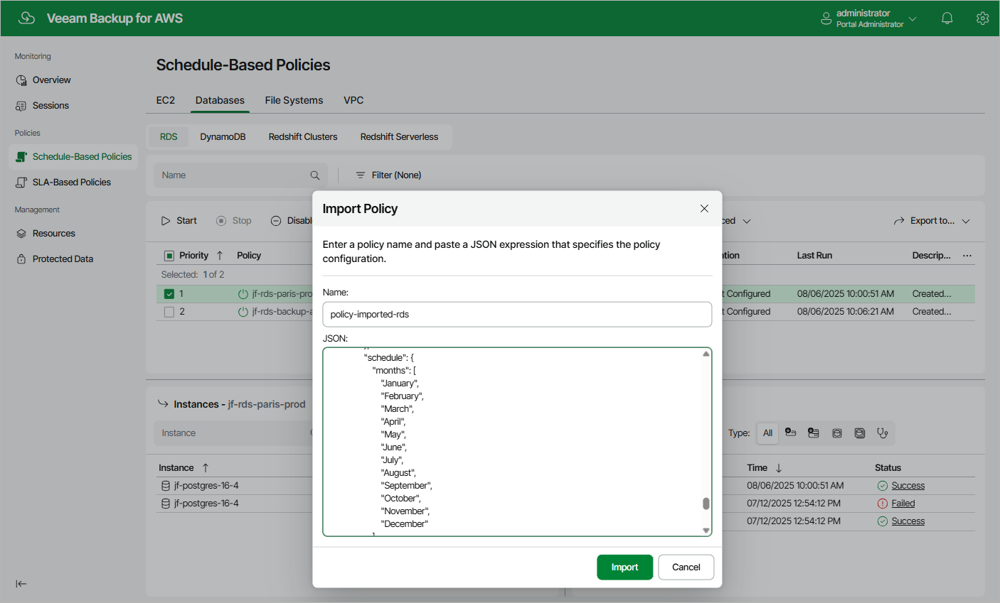

In this article

Veeam Backup for AWS allows you to use settings of an existing schedule-based backup policy as a template for creating other backup policies. You can export a backup policy to a .JSON file, modify the necessary settings in the file, and then import the policy to the same or a different backup appliance.

Exporting Backup Policies

To export a schedule-based backup policy to a .JSON file:

1. Navigate to Policies.

1. Switch to the necessary tab and select the backup policy whose settings you want to export.
2. Click Advanced > Export Policy.

Veeam Backup for AWS will save the backup policy settings as a single .JSON file to the default download directory on the local machine.

Importing Backup Policies

To import a schedule-based backup policy from a .JSON file:

1. Navigate to Policies.
2. Switch to the necessary tab and click Advanced > Import Policy.
3. In the Import Policy window, specify a name for the imported backup policy, paste the content of the necessary .JSON file, and click Apply.

Page updated 8/6/2025

Page content applies to build 10.0.0.232
