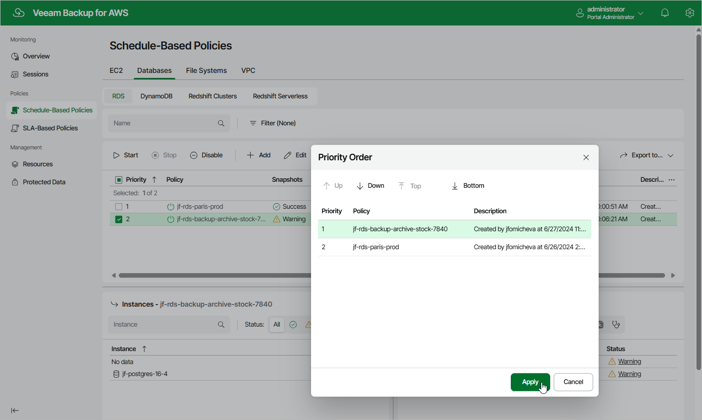

In this article

By default, Veeam Backup for AWS runs backup policies in the order you create them. However, you can set the backup policy priority manually:

1. Navigate to Policies.

1. Switch to the necessary tab and click Policy Priority.
2. In the Priority Order window, do the following:

1. Select a backup policy in the list of existing policies.
2. To move the policy up or down the list, use the Up and Down arrows.
3. To save changes made to the priority order, click Apply.

|  |
| --- |
| Note |
| If a resource is included into multiple backup policies, it will be processed only by the backup policy that has the highest priority. |

Page updated 11/4/2025

Page content applies to build 10.0.0.232
