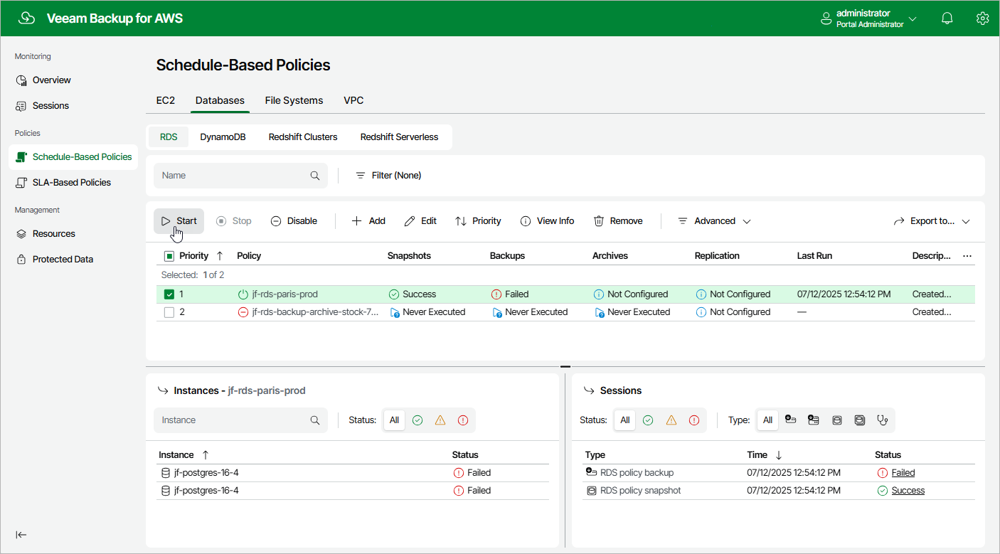

In this article

You can start a schedule-based backup policy manually, for example, if you want to create an additional restore point in the snapshot or backup chain and do not want to modify the configured backup policy schedule. You can also stop a backup policy if processing of an instance is about to take too long, and you do not want the policy to have an impact on the production environment during business hours.

To start or stop a schedule-based backup policy, do the following:

1. Navigate to Policies.
2. Switch to the necessary tab and select the backup policy.

1. Click Start or Stop.

|  |
| --- |
| Notes |
| * The created restore points will be retained for the time period specified in the most frequent backup policy schedule.  * [Applies only to EC2 backup policies] If the backup policy stores backups in a backup repository with immutability settings enabled, the created restore points will be immutable for the time period determined based on the retention settings specified in the most frequent backup policy schedule. For more information, see [Immutability](immutability.md). |

Page updated 10/8/2025

Page content applies to build 10.0.0.232
