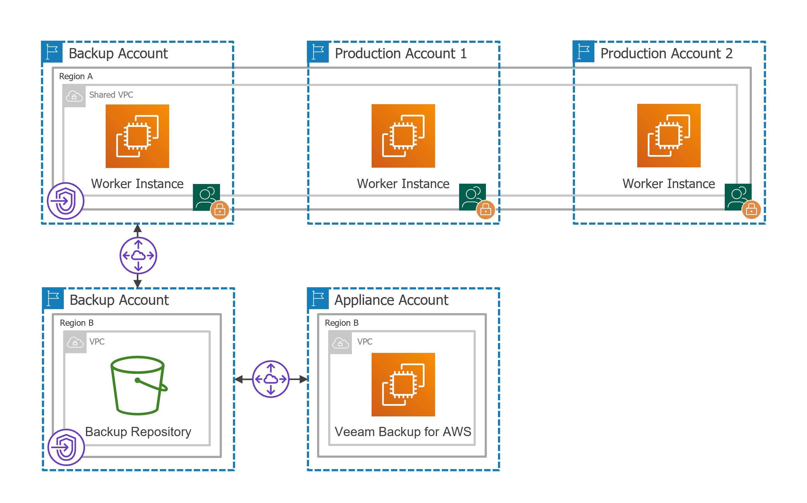

In this article

If you have multiple AWS accounts and want to deploy worker instances in [production accounts](worker_options.md#production), the estimated cost of VPC endpoints per account may occur to be significantly high. To reduce the cost, you can create a single resource share in one AWS account for all subnets to which the worker instances will be connected, and share the resource with other AWS accounts belonging to the same organization.

For Veeam Backup for AWS to be able to deploy worker instances in a private environment in production accounts, perform the following steps:

1. [Create VPC interface and S3 interface endpoints for subnets to which the worker instances will be connected](create_interface_endpoints_prod.md).
2. [Create a peering connection between VPCs](create_vpc_peering_connection_prod.md).
3. [Add routes to the route tables associated with the subnets of the VPCs](configure_routing_network_prod.md).

1. [Create a resource share to share the subnets with other AWS accounts](resource_share.md).

1. [In each production account, create security groups that will be associated with worker instances connected to the shared subnets](seciruty_groups_workers.md).

Page updated 5/31/2024

Page content applies to build 10.0.0.232
